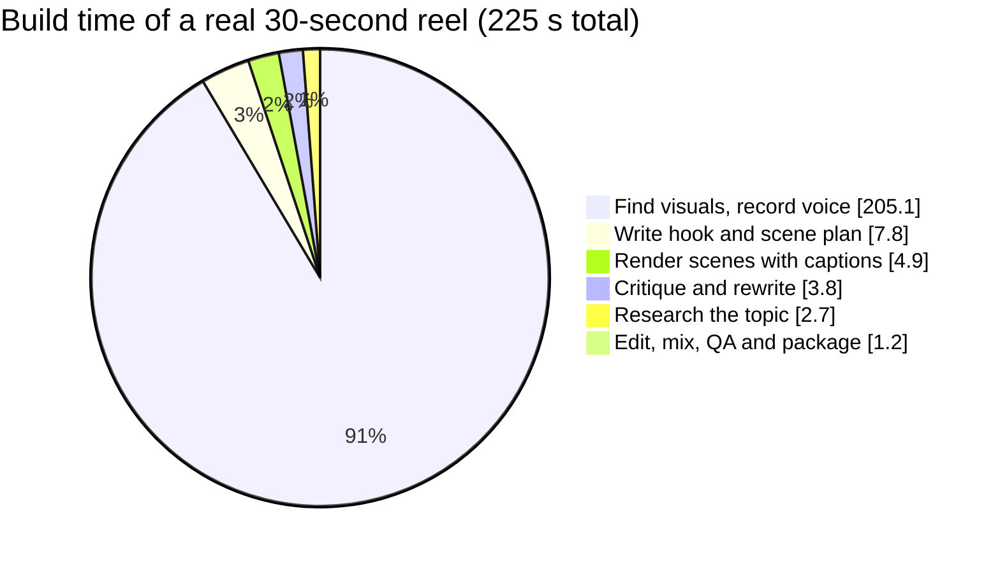
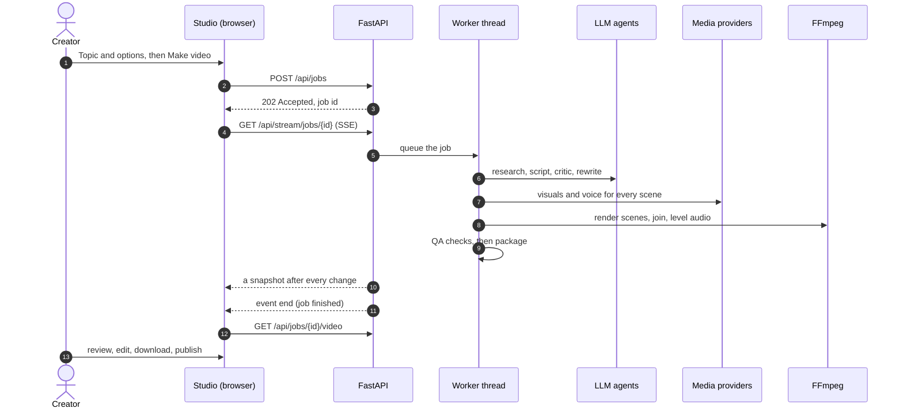

  

<h1 align="center">Qreate</h1>

<h3 align="center">Topic in. Publish-ready Qoneqt reel out.</h3>

  An AI video studio that turns any topic, prompt, idea or trend into a captioned 9:16 video
  for the <b>Qoneqt Global Feed</b>. 
  One repeatable pipeline researches, writes, critiques, voices, edits, quality-checks and packages every reel,
  in <b>English, हिन्दी and Hinglish</b>.

  
  
  
  
  
   
  
  
  
  

  Built by <b>Team Fantastic Four</b> for <b>Qoneqt × CTRL FREAK 2026</b>: LLM-Powered Content Pipeline

  <a href="https://qoneqt.com/qlips/8080"><b>▶ Our reel on Qoneqt</b></a> ·
  <a href="https://youtu.be/41FZuaFv9hQ"><b>🎥 Demo video</b></a> ·
  <a href="https://youtu.be/1v8AfLAQ8ko"><b>🎙️ Project explanation</b></a> ·
  <a href="#demo">Demo</a> ·
  <a href="#quick-start">Quick start</a> ·
  <a href="#how-it-works">How it works</a> ·
  <a href="#the-llm-layer">LLM layer</a> ·
  <a href="#tech-stack">Tech stack</a> ·
  <a href="#api-reference">API</a>

---

## Contents

| | | |
|---|---|---|
| **Overview** [Team](#team) [Demo](#demo) [At a glance](#at-a-glance) [The problem and our answer](#the-problem-and-our-answer) [Features, with screenshots](#features-with-screenshots) [Sample output](#sample-output) | **How it's built** [How it works](#how-it-works) [The LLM layer](#the-llm-layer) [The media engine](#the-media-engine) [Jobs, edits and caching](#jobs-edits-and-caching) [Architecture](#architecture) [Tech stack](#tech-stack) | **Use and run it** [Quick start](#quick-start) [Using the studio](#using-the-studio) [Command line](#command-line) [Configuration](#configuration) [API reference](#api-reference) [What you get](#what-you-get) [Quality checks](#quality-checks) [Testing](#testing) [Deployment](#deployment) [Optional: Wan 2.1](#optional-wan-21-local-text-to-video) [Project layout](#project-layout) [Troubleshooting](#troubleshooting) [Responsible AI and security](#responsible-ai-and-security) [Limitations and roadmap](#limitations-and-roadmap) |

---

## Team

| | |
|---|---|
| 👥 **Team** | Fantastic Four |
| 🔑 **Team code** | `team-7D4CF0F857DD` |
| 🧑‍💻 **Members** | Dhruvil Prajapati · Ronak Hinglajiya · Mihir Bhavsar · Vishwa Patel |
| 🏁 **Challenge** | Qoneqt × CTRL FREAK 2026: LLM-Powered Content Pipeline |
| 🎥 **Demo video** | [youtu.be/41FZuaFv9hQ](https://youtu.be/41FZuaFv9hQ) |
| 🎙️ **Project explanation** | [youtu.be/1v8AfLAQ8ko](https://youtu.be/1v8AfLAQ8ko) (with our voice-over) |
| 📱 **Our reel on Qoneqt** | [qoneqt.com/qlips/8080](https://qoneqt.com/qlips/8080) |
| 💻 **Repository** | [dhruvil1309/Qreate-AI-powered-videos-made-simple](https://github.com/dhruvil1309/Qreate-AI-powered-videos-made-simple) |

---

## Demo

### ▶ Watch our reel on Qoneqt

  

**Qoneqt video link:** <https://qoneqt.com/qlips/8080>

This is our **customised, LLM-generated video**, made end to end with Qreate and published on Qoneqt:
- the LLM agents researched the topic, wrote the script and critiqued it;
- the pipeline generated the visuals and the voice, then edited, captioned and quality-checked the reel;
- we published the final reel as a Qoneqt Qlip.

### 🎥 Demo video

  
    
  
   
  👆 Click the preview to play the full demo on YouTube · <a href="https://youtu.be/41FZuaFv9hQ">youtu.be/41FZuaFv9hQ</a>

### 🎙️ Project explanation video (with our voice-over)

  
    
  
   
  🎙️ Our team explains Qreate in our own voice-over · <a href="https://youtu.be/1v8AfLAQ8ko">youtu.be/1v8AfLAQ8ko</a>

### 📡 See it in action

<table>
  <tr>
    <td align="center" width="34%">
       
      <b>A real build, streamed live</b> (time-lapse of the actual job)
    </td>
    <td align="center" width="66%">
       
      <b>Four reels made by Qreate</b> English · Hinglish · Hindi · English
    </td>
  </tr>
</table>

---

## At a glance

| | | | |
|:---:|:---:|:---:|:---:|
| 🧭 **8** pipeline stages, topic to package | 🤖 **3** LLM agents: research, script, critic | 🔀 **4** LLM providers behind one router | 🗣️ **3** languages: English, Hindi, Hinglish |
| 🎯 **6** critic rubric criteria, pass mark 7.5 | ✅ **10** automated QA checks (6 blocking) | 📱 **1080×1920** H.264/AAC, 30 fps, −14 LUFS | ⏱️ **~4 min** per 30-second reel on free tiers |
| 📦 **50** topics per batch request | ✂️ **1 scene** re-rendered per edit, not the whole reel | 🔑 **0** API keys needed to run | 🧪 **21 + 74** pytest tests + UAT cases passing |

---

## The problem and our answer

Qoneqt asked how AI can turn ideas into engaging videos for the Global Feed **at scale**.

- **Hours per reel.** Research, scripting, finding visuals, recording a voice, editing and captioning are all manual.
- **Uneven quality.** Nothing checks the hook, the facts, the pacing or the format before a post goes out.
- **One by one doesn't scale.** Each new topic restarts the whole process from scratch.

**The gap:** no repeatable, fact-grounded, community-aware pipeline with quality control built in.
Qreate is that pipeline.

| The brief asks for | Qreate delivers | Where |
|---|---|---|
| Input: a topic, prompt, idea or trend | Free text, batch lists of up to 50 topics, live Google Trends for India | Composer, `/api/batch`, `/api/trends` |
| An LLM that writes the script and story | Research-grounded script agent with a critic agent and a rewrite loop | [The LLM layer](#the-llm-layer) |
| Multimodal models for visuals and video | AI images, stock footage, optional local AI video, neural voices | [The media engine](#the-media-engine) |
| A pipeline that composes and processes | FFmpeg edit, word-synced captions, loudness levelling, 10-check QA gate | [How it works](#how-it-works) |
| Ready-to-publish Global Feed video | 1080×1920 MP4 + thumbnail + title, description and hashtags, zipped | [What you get](#what-you-get) |
| Repeatable, at scale | Batch queue, parallel workers, scene-level caching, jobs saved on disk | [Jobs, edits and caching](#jobs-edits-and-caching) |

**Humans stay in charge.** Every reel can be reviewed and edited scene by scene before posting, and every
post carries a reminder to label it as AI-generated.

---

## Features, with screenshots

### 🎛️ The studio

The studio has three columns. On the left you **create**, in the middle a **phone preview** plays the reel,
and on the right you **inspect and edit** the selected video. The header shows totals: videos made, ready,
average critic score and average build time.

### ✍️ Create: one video or a batch

<table>
  <tr>
    <td width="50%"></td>
    <td width="50%"></td>
  </tr>
  <tr>
    <td><b>Batch mode:</b> one topic per line becomes a queue of videos ("Make 3 videos").</td>
    <td><b>Engines panel:</b> which script, research, visual and voice engines are live, with hints for keys you could add.</td>
  </tr>
</table>

- **Topic box:** any topic, prompt, idea or trend, up to 600 characters.
- **Trending chips:** live Google Trends for India. **New ideas** fetches a fresh set.
- **Community:** pick or type a Qoneqt community (Study Buddies, Space Nerds, Tech Talk, Finance Basics, Health & Fitness, …).
- **Tone:** energetic, calm and clear, funny, inspiring, or serious explainer.
- **Language:** English, Hinglish (Roman script) or Hindi (Devanagari).
- **Visuals:** **Mix** lets the script choose per scene, **Real footage** prefers stock, **AI images** prefers generated art.
- **Length:** 30, 45 or 60 seconds. The API accepts anything from 20 to 90.
- **Shortcuts:** `Ctrl`/`⌘` + `Enter` submits from anywhere; `/` jumps to the topic box.

### 📡 Watch it build, live

<table>
  <tr>
    <td width="62%"></td>
    <td width="38%">
      Progress streams over <b>Server-Sent Events</b>, with no page refresh and no polling.  
      The phone shows a progress ring, the running stage, and every finished stage with its <b>real duration</b>
      and result (for example "3 sources", "5 scenes by openai", "8.0/10 after 1 rewrite").  
      The script, including its alternative hooks, appears on the right as soon as it's written, before any media exists.
    </td>
  </tr>
</table>

### 🎬 Play, jump to any scene, preview one scene

<table>
  <tr>
    <td width="50%"></td>
    <td width="50%"></td>
  </tr>
  <tr>
    <td><b>Single-scene preview:</b> click any scene thumbnail in the Script tab to play that scene alone.</td>
    <td><b>Works on phones:</b> the layout reflows for small screens.</td>
  </tr>
</table>

- The finished reel plays in the phone frame with a **QA badge** ("QA passed" or "N warnings").
- The **scene strip** shows a thumbnail per scene. Click one to jump the player to that scene.
- Buttons: **Download video**, **Package** (ZIP), **Open full size**.

### 🧐 Review: the critic's scores and the QA checklist

- **Overall score**, how many rewrites it took ("Rewritten 1 time to get here" or "Approved on the first pass"), and which model judged it.
- **Six rubric bars:** hook, clarity, accuracy, pacing, community fit and safety. Bars are coloured good (≥ 8), mid (≥ 6.5) or poor.
- **What the critic flagged:** up to 6 concrete fixes.
- **Quality checks:** all 10 checks with their measured values. Advisory checks are tagged so they're not mistaken for blockers.

### ✏️ Edit any scene, re-render only that scene

- **Opening hook:** pick one of the script agent's alternative hooks. Only scene 1's narration is re-recorded.
- **Per scene:** edit the on-screen text, the narration, and the image prompt or footage search, then **Save and re-render**.
- **Try another visual:** re-rolls just that scene's visual with a new seed or the next search result.
- Edits in progress are flagged "Unsaved" and kept while you type. Live progress updates never overwrite them.

### 📣 Post: publish-ready copy, no re-render

- Edit the **title, description and hashtags**, and see a live preview of the caption.
- **Save copy** rewrites `post.txt`, `plan.json` and the ZIP package **without touching the video**.
- **Copy caption**, download links, a step-by-step posting guide, and the research **sources**.
- A reminder to **label the post as AI-generated** on Qoneqt.

### ⏱️ Activity: real timings for every stage

### 🗂️ Library, filters and dark mode

- **Your videos:** search by title or topic; filter by All, In progress, Ready or Failed.
- **Retry** a failed job, or **delete** a job together with its files.
- **Light and dark themes:** follows your system setting and remembers your choice.

---

## Sample output

Every image below is a frame from a reel Qreate made end to end: script, visuals, voice, captions and edit.

<table>
  <tr>
    <td align="center"></td>
    <td align="center"></td>
    <td align="center"></td>
    <td align="center"></td>
  </tr>
  <tr>
    <td align="center"><b>English</b> · Space Nerds "Chandrayaan-3: India's Stellar Moon Landing Journey" 27.3 s · AI images</td>
    <td align="center"><b>Hinglish</b> · Space Nerds "ISRO Missions: Choti Cost, Badi Success" 27.5 s · critic 8.0 · 10/10 QA</td>
    <td align="center"><b>हिन्दी</b> · Finance Basics "UPI ने भारत में पेमेंट को कैसे बदला?" 18.1 s · AI images</td>
    <td align="center"><b>English</b> · Study Buddies "5 Study Habits Backed by Science" 18.3 s · 10/10 QA</td>
  </tr>
</table>

**One reel, scene by scene:** each scene has its own visual, a headline, and captions that highlight the word
being spoken.

---

## How it works

| # | Stage (as shown in the studio) | What happens | Output |
|:-:|---|---|---|
| 1 | **Research the topic** | Wikipedia's top 3 matching articles, plus Tavily web search when a key is set. Up to 8 notes with source links. | `notes.json` |
| 2 | **Write hook and scene plan** | The script agent writes the hook, alternative hooks and a scene-by-scene plan as strict JSON. | `plan.json` |
| 3 | **Critique and rewrite** | The critic scores 6 criteria. Below 7.5 the script is rewritten with the critic's fixes, up to 2 rounds. | critique in `job.json` |
| 4 | **Find visuals, record voice** | Every scene gets a visual and a narration track, 4 scenes at a time, with caching. | `scenes/NN/assets.json` |
| 5 | **Render scenes with captions** | Background motion, headline, word-highlighted captions and voice are composed per scene, 2 scenes at a time. | `scenes/NN/scene.mp4` |
| 6 | **Edit, mix and level audio** | Scenes are joined, an optional music bed is mixed in, and loudness is normalised. | `output/qreate-<slug>.mp4` |
| 7 | **Run quality checks** | 10 technical and editorial checks; 6 of them decide whether the video is ready. | QA in `job.json` |
| 8 | **Package for Qoneqt** | Thumbnail, `post.txt` and `plan.json` are zipped with the video. | `package.zip` |

### Where the time goes

Measured on a real 30-second English reel ("5 Study Habits Backed by Science") with free-tier providers:

Over 90% of the build is the visuals-and-voice stage, and almost all of that is waiting for images. The free
Pollinations tier allows roughly **one image every 50 seconds**, so Qreate queues image requests and retries
politely. Research, script and critic together take about 15 seconds; rendering, editing and QA about 6.

### One request, end to end

---

## The LLM layer

Qreate uses hosted LLMs as **specialised agents** that share one structured plan, the `ScenePlan`. Each agent
has a narrow job and a validated contract, so the output of one is always safe input for the next.

### 🔎 Research agent: grounding

| | |
|---|---|
| **Wikipedia** (always, no key) | Searches for the topic, then fetches the summaries of the top 3 articles (up to 900 characters each) with their links. |
| **Tavily** (optional key) | Adds a search summary and up to 5 fresh web results. Useful for trending topics. |
| **Result** | Up to 8 notes, numbered `[1] title: snippet` in the script prompt. Notes with a URL become the post's **Sources**. |
| **If nothing is found** | The prompt says "no research available, stay general and avoid specific statistics". The stage shows "No live sources". |

### ✍️ Script agent: the story

The script agent writes the whole reel as **one JSON object**. Its brief is sized from the target length:
about **2.4 spoken words per second**, split across `max(4, min(9, round(seconds ÷ 6.5)))` scenes.

<!-- ⚠️ The README pasted into chat ended here. Paste the rest of your original README below this line,
     starting from the "| Target | Scenes asked for | Spoken ..." table. -->
