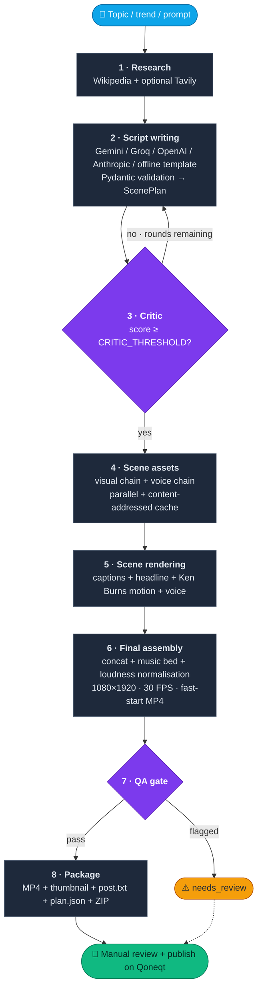
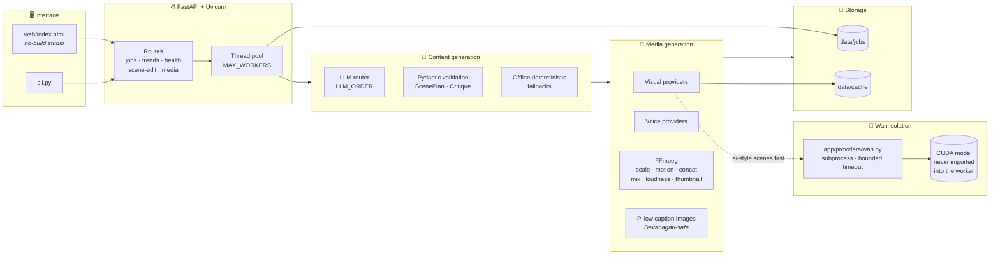
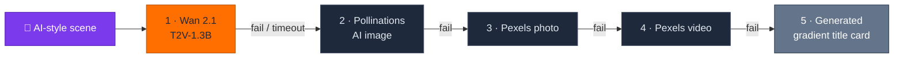
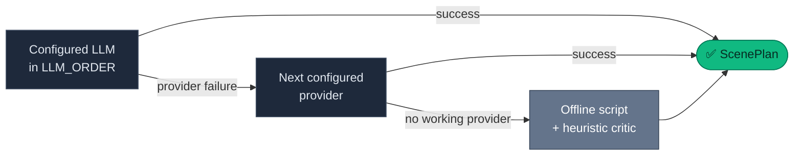
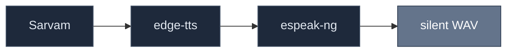
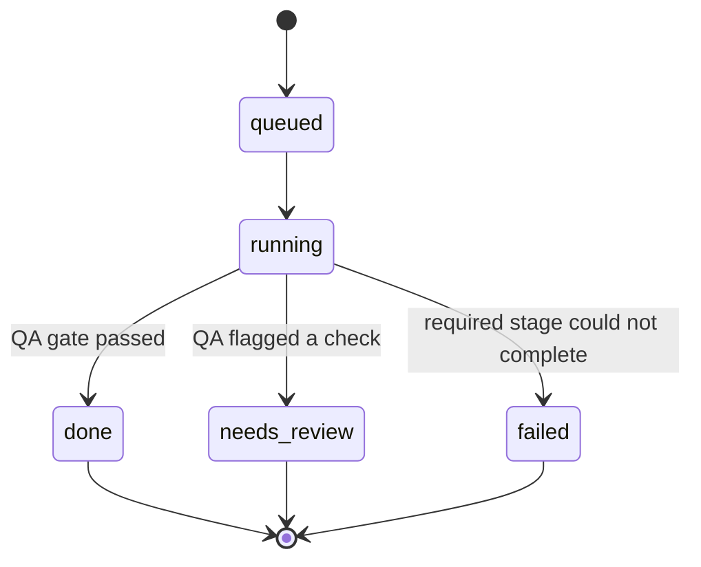

<div align="center">

# 🎬 Qreate

### **Topic in → publish-ready Qoneqt video out**

*An LLM-assisted, repeatable short-form video production pipeline for the
**Qoneqt Global Feed** and community pages.*

<br/>


</div>

---

## 📦 What comes out of one run

Give it a topic, idea, prompt, or trend and it produces a vertical social video with:

<table>
<tr>
<td width="50%" valign="top">

| | Deliverable |
|:--:|---|
| 🔎 | Research notes and source links |
| 🪝 | A hook-first, scene-by-scene script |
| 🧐 | An automated critic and rewrite loop |
| 🎨 | Per-scene visuals and narration |
| 💬 | Word-synchronised captions |

</td>
<td width="50%" valign="top">

| | Deliverable |
|:--:|---|
| 📱 | A 1080×1920 MP4 formatted for a mobile feed |
| 🖼️ | A thumbnail, caption, hashtags, and source list |
| ✅ | Automated technical and editorial quality checks |
| 🗜️ | A ZIP package ready for manual publishing |

</td>
</tr>
</table>

The application is a **Python/FastAPI service** with a **no-build-step browser
studio**. It can run with **no API keys** in offline/fallback mode, or it can use
optional hosted providers for better scripts, research, footage, images, and
voices. It also includes an optional native integration with the official
**Wan 2.1 T2V-1.3B** text-to-video runtime.

> [!IMPORTANT]
> **Qreate is an AI-assisted production tool, not an automatic Qoneqt uploader.**
> Qoneqt publishing remains a manual step: download the package, review it, copy
> the generated caption, and **mark the post as AI-generated** when publishing.

---

## 🧭 Contents

<table>
<tr>
<td valign="top">

**Getting started**
1. [What the application does](#-what-the-application-does)
2. [End-to-end pipeline](#-end-to-end-pipeline)
3. [Current architecture](#-current-architecture)
4. [Requirements](#-requirements)
5. [Windows setup](#-windows-setup)
6. [Running the project](#-running-the-project)
7. [Using the browser studio](#-using-the-browser-studio)
8. [Command-line usage](#-command-line-usage)

</td>
<td valign="top">

**Configuration & behavior**

9. [Wan 2.1 integration](#-wan-21-integration)
10. [Configuration reference](#-configuration-reference)
11. [Provider and fallback behavior](#-provider-and-fallback-behavior)
12. [API reference](#-api-reference)
13. [Job lifecycle and files](#-job-lifecycle-and-files)
14. [Video and caption output](#-video-and-caption-output)

</td>
<td valign="top">

**Operating it**

15. [Quality assurance](#-quality-assurance)
16. [Batch processing & scene editing](#-batch-processing-and-scene-editing)
17. [Project layout](#-project-layout)
18. [Deployment](#-deployment)
19. [Testing and validation](#-testing-and-validation)
20. [Troubleshooting](#-troubleshooting)
21. [Security and operational notes](#-security-and-operational-notes)
22. [Limitations and future improvements](#-limitations-and-future-improvements)

</td>
</tr>
</table>

---

## ⚡ Quick start

```powershell
# 1 · environment
py -3.11 -m venv .venv
.\.venv\Scripts\Activate.ps1
python -m pip install -r requirements.txt

# 2 · config (every key is optional)
Copy-Item .env.example .env

# 3 · run
uvicorn app.main:app --reload
```

Then open **<http://127.0.0.1:8000/>** → enter a topic → download the package.

> [!TIP]
> No API keys? It still works. Qreate falls back to an offline script template,
> generated visual cards, and a rendering-safe audio path so you always get a
> reviewable video.

---

## 🎯 What the application does

Qreate combines content planning, media generation, editing, and packaging in
one workflow:

| # | Stage | What happens |
|:--:|---|---|
| **1** | 📝 **Input** | Topic, target Qoneqt community, language, tone, duration, and visual style. |
| **2** | 🔎 **Research** | Wikipedia is queried by default. Tavily can add fresh web research when configured. |
| **3** | ✍️ **Writing** | An LLM creates a validated `ScenePlan`. Without an LLM, Qreate creates a safe offline template. |
| **4** | 🧐 **Critique** | The draft is scored for hook strength, clarity, accuracy, pacing, community fit, and safety. Low-scoring LLM drafts can be rewritten. |
| **5** | 🎨 **Assets** | Each scene receives a visual and a voiceover. Scenes are processed in parallel and cached on disk. |
| **6** | 🎞️ **Editing** | Visuals, narration, captions, motion, music, and audio processing are combined with FFmpeg. |
| **7** | ✅ **QA** | The finished video is checked for dimensions, duration, black frames, audio, hook, CTA, and other technical/editorial requirements. |
| **8** | 📦 **Packaging** | The MP4, thumbnail, `post.txt`, `plan.json`, and source information are placed in a ZIP file. |

> [!NOTE]
> The pipeline is **restart-safe**. Job metadata and intermediate assets are
> stored on disk, and completed scene assets are reused instead of being
> downloaded or generated again.

---

## 🔄 End-to-end pipeline



<details>
<summary><b>📄 Plain-text version of the same pipeline (for terminals)</b></summary>

```text
Topic / trend / prompt
          |
          v
1. Research
   Wikipedia + optional Tavily
          |
          v
2. Script writing
   Gemini / Groq / OpenAI / Anthropic / offline template
   Pydantic validation -> ScenePlan
          |
          v
3. Critic
   LLM rubric or heuristic critic
   Optional rewrite loop until score >= CRITIC_THRESHOLD
          |
          v
4. Scene assets
   Visual provider chain + voice provider chain
   Parallel generation + content-addressed caching
          |
          v
5. Scene rendering
   Captions + headline + Ken Burns motion + voice
          |
          v
6. Final assembly
   Concatenation + music bed + loudness normalisation
   1080x1920, 30 FPS, fast-start MP4
          |
          v
7. QA
   Blocking and editorial checks
          |
          v
8. Package
   MP4 + thumbnail + post.txt + plan.json + ZIP
```

</details>

### 📊 Pipeline stages

| | Stage | Purpose | Main output |
|:--:|---|---|---|
| 🔎 | **Research** | Collect background information and citations | `notes.json` |
| ✍️ | **Script** | Create a structured short-form plan | `plan.json` |
| 🧐 | **Critic** | Score and optionally improve the plan | `critique` in `job.json` |
| 🎨 | **Assets** | Generate or fetch scene visuals and voice | `scenes/<number>/assets.json` |
| 🎞️ | **Render** | Produce one MP4 per scene | `scenes/<number>/scene.mp4` |
| 🧵 | **Assemble** | Join scenes and add final media processing | `output/qreate-*.mp4` |
| ✅ | **QA** | Verify technical and editorial requirements | QA checks in `job.json` |
| 📦 | **Package** | Prepare publishing files | `package.zip` |

---

## 🏗️ Current architecture



### 🔌 API and user interface

- **FastAPI** exposes job, trend, health, scene-edit, and media-download endpoints.
- **Uvicorn** runs the ASGI server.
- **`web/index.html`** is a static browser studio served by FastAPI. It does
  **not** require a frontend build tool or Node.js.
- Jobs are submitted asynchronously to a thread pool, so the API can return a
  job ID while video work continues.

### 🧠 Content generation

- The LLM router tries configured providers in `LLM_ORDER`.
- Script and critic outputs are validated with Pydantic models.
- Offline mode uses **deterministic local fallbacks** rather than returning a
  success-shaped response from a failed network provider.

### 🎨 Media generation

- Visual and voice generation happen **per scene**.
- Assets are cached in `data/cache`.
- FFmpeg performs conversion, scaling, motion, concatenation, audio mixing,
  loudness processing, and thumbnail extraction.
- Caption images are rendered with **Pillow** so Hindi/Devanagari text does not
  depend on libass subtitle support.

### 🧊 Wan isolation

Wan is launched in a subprocess through [`app/providers/wan.py`](app/providers/wan.py).
The large CUDA model is **not** imported into the FastAPI worker. This keeps API
startup responsive and isolates CUDA/runtime failures. Wan is attempted first
for AI-style scenes; if it fails or times out, the existing visual fallbacks
are tried.

---

## 📋 Requirements

### ✅ Required for the normal application

| | Requirement |
|:--:|---|
| 🐍 | Python **3.11 or newer** |
| 🎞️ | FFmpeg available on `PATH` |
| 💻 | A Windows, Linux, or macOS environment |
| 💾 | Enough free disk space for job assets and rendered videos |
| 🌐 | Internet access **only** for hosted providers — offline fallbacks do not require provider keys |

### 🖥️ Required for the full Wan setup

| | Requirement |
|:--:|---|
| 🟩 | NVIDIA GPU with CUDA support |
| 🔥 | A compatible CUDA-enabled PyTorch installation |
| 📦 | The official Wan 2.1 runtime and **complete** T2V-1.3B checkpoints |
| 💾 | Significant disk space for the model files |
| ⏱️ | More time and VRAM than a normal image-generation pipeline |

Generation speed depends heavily on GPU, precision, offload settings, frame
count, and sampling steps.

> [!WARNING]
> The current development machine uses an **NVIDIA RTX 3060 with 12 GB VRAM**.
> Readiness is verified, but native Wan generation can still be very slow on this
> class of hardware. Qreate therefore uses a **bounded timeout** and falls back
> instead of blocking a job forever.

---

## 🪟 Windows setup

The commands below are PowerShell commands and use the project's local `.venv`.
Run them from:

```text
G:\Dhruvil Projects\Hackbriven\qreate
```

### 1️⃣ Create or repair the virtual environment

```powershell
py -3.11 -m venv .venv
.\.venv\Scripts\Activate.ps1
python -m pip install --upgrade pip
```

If PowerShell blocks activation, either allow scripts for the current user or
run the executable directly:

```powershell
Set-ExecutionPolicy -Scope CurrentUser RemoteSigned
.\.venv\Scripts\Activate.ps1
```

### 2️⃣ Install base dependencies

```powershell
python -m pip install -r requirements.txt
```

### 3️⃣ Install FFmpeg

Install FFmpeg separately and make sure this succeeds in a **new** terminal:

```powershell
ffmpeg -version
```

The application checks for FFmpeg through `PATH`. A missing FFmpeg binary
prevents rendering and is reported by `/api/health`.

### 4️⃣ Create local configuration

```powershell
Copy-Item .env.example .env
```

Open `.env` and add **only the keys you actually want to use**. Every key is
optional. **Do not commit `.env`.**

### 5️⃣ Optional: install Wan dependencies

```powershell
python -m pip install -r requirements-wan.txt
```

For a GPU installation, use the PyTorch wheel appropriate for the installed
CUDA driver. Confirm the selected interpreter sees CUDA:

```powershell
python -c "import torch; print(torch.__version__); print(torch.cuda.is_available()); print(torch.cuda.get_device_name(0) if torch.cuda.is_available() else 'CPU')"
```

The project's Wan files are expected at:

```text
.venv\wan2.1-runtime\
.venv\models\wan2.1-t2v-1.3b\
```

> [!CAUTION]
> Do not place credentials or model files in source-controlled files.

---

## ▶️ Running the project

### Start the development server

```powershell
.\.venv\Scripts\Activate.ps1
uvicorn app.main:app --reload
```

Open:

| | Surface | URL |
|:--:|---|---|
| 🎬 | Studio | <http://127.0.0.1:8000/> |
| 📘 | Interactive API documentation | <http://127.0.0.1:8000/docs> |
| 📕 | Alternative API documentation | <http://127.0.0.1:8000/redoc> |
| 💚 | Health endpoint | <http://127.0.0.1:8000/api/health> |

The server should remain running in the terminal. Stop it with `Ctrl+C`.

### Start on a different host or port

```powershell
uvicorn app.main:app --host 0.0.0.0 --port 8000
```

> [!WARNING]
> When exposing the service outside the local machine, use a reverse proxy,
> authentication, HTTPS, and a protected data directory. **The development API
> does not provide user authentication.**

### Verify the service

```powershell
Invoke-RestMethod http://127.0.0.1:8000/api/health
```

The response reports active LLM providers, research providers, visual engines,
voice engines, FFmpeg availability, worker count, and Wan readiness.

---

## 🎛️ Using the browser studio

```mermaid
flowchart LR
    S1["1 · Start server"] --> S2["2 · Open<br/>127.0.0.1:8000"] --> S3["3 · Enter topic"]
    S3 --> S4["4 · Community"] --> S5["5 · Language"] --> S6["6 · Tone + duration"]
    S6 --> S7["7 · Visual style"] --> S8["8 · Submit job"] --> S9["9 · Poll progress"]
    S9 --> S10["10 · Review plan, critique,<br/>scenes, QA, outputs"] --> S11["11 · Download<br/>MP4 / thumbnail / ZIP"]
    S11 --> S12(["12 · Publish manually<br/>on Qoneqt"]):::done

    classDef done fill:#10B981,stroke:#047857,color:#062B22
```



1. Start the server.
2. Open <http://127.0.0.1:8000/>.
3. Enter a topic, prompt, idea, or trend.
4. Select the target community.
5. Select `english`, `hinglish`, or `hindi`.
6. Choose a tone and target duration.
7. Choose visual style:

   | Style | Behavior |
   |---|---|
   | 🔀 `mix` | Use the scene plan to choose stock or AI-style visuals |
   | 📷 `stock` | Prefer Pexels footage/photos |
   | 🤖 `ai` | Prefer Wan 2.1, then AI images and other fallbacks |

8. Submit the job.
9. Poll the job progress in the studio.
10. Review the plan, critique, scenes, QA result, and outputs.
11. Download the MP4, thumbnail, or ZIP package.
12. Publish manually on Qoneqt after reviewing the content.

> [!NOTE]
> Target duration is validated between **20 and 90 seconds**. The final duration
> depends on narration timing and scene padding, so it may not be exactly equal
> to the requested target.

---

## ⌨️ Command-line usage

The CLI is useful for local runs, automation, and batch jobs:

```powershell
.\.venv\Scripts\python.exe cli.py "Why ISRO missions cost so little" `
  --community "Space Nerds" `
  --language hinglish `
  --tone energetic `
  --seconds 45 `
  --style mix
```

### Arguments

| Argument | Default | Description |
|---|---:|---|
| `topic` | — | One topic, prompt, idea, or trend |
| `--batch FILE` | — | Text file with one topic per line |
| `--community` | `General` | Target Qoneqt community |
| `--language` | `english` | `english`, `hinglish`, or `hindi` |
| `--tone` | `energetic` | Writing and narration tone |
| `--seconds` | `45` | Requested duration, from 20 to 90 |
| `--style` | `mix` | `mix`, `stock`, or `ai` |

### Batch mode

Example batch file:

```text
How Chandrayaan-3 landed on the Moon
Why electric vehicles are getting cheaper
Three habits that improve deep work
```

Run it:

```powershell
.\.venv\Scripts\python.exe cli.py --batch topics.txt --seconds 40
```

The CLI prints each stage status and the final video path. It returns a
**non-zero exit code** if one or more jobs fail.

---

## 🧊 Wan 2.1 integration


Qreate integrates the official Wan 2.1 **T2V-1.3B** text-to-video runtime for
AI-style scene backgrounds. It is a **local model path, not a hosted API**.

### 📁 Runtime and checkpoint locations

By default, all Wan files are kept inside the project virtual environment:

```text
.venv\wan2.1-runtime\generate.py
.venv\models\wan2.1-t2v-1.3b\
```

### 🔍 Readiness check

| File | Readiness requirement |
|---|---|
| `generate.py` | Official runtime exists |
| `diffusion_pytorch_model.safetensors` | Exists and is **at least 5 GB** |
| `models_t5_umt5-xxl-enc-bf16.pth` | Exists and is **at least 10 GB** |
| `Wan2.1_VAE.pth` | Exists and is **at least 400 MB** |

> [!NOTE]
> The size checks catch interrupted downloads. A file existing with an
> incomplete size is **not** treated as a usable model.

### 🔗 How Wan is selected



For a **stock/mixed** scene, the chain normally starts with Pexels and then uses
Pollinations before the generated card fallback. Wan is therefore used for
**AI-style scenes, not every scene**.

### ⚙️ Wan generation settings

The default settings are:

```text
Task:             t2v-1.3B
Size:             832*480
Frames:           49
Sampling steps:   30
Guidance scale:   6
Sample shift:     8
Model offload:    enabled
T5 CPU mode:      enabled
Timeout:          600 seconds
```

Wan creates a scene video which is then processed by the normal Qreate
rendering and assembly pipeline. Wan generation is isolated in a subprocess;
its stdout/stderr is captured and failures are logged.

### 🩺 Check Wan status

```powershell
Invoke-RestMethod http://127.0.0.1:8000/api/health | ConvertTo-Json -Depth 6
```

Example shape:

```json
{
  "wan2_1": {
    "enabled": true,
    "ready": true,
    "detail": "ready"
  }
}
```

| Field | Meaning |
|---|---|
| `enabled: true` | Configuration allows Wan |
| `ready: true` | The runtime and checkpoint size checks passed |
| ⚠️ | It does **not** guarantee that a specific generation will finish within the configured timeout |

### 🔧 Wan environment variables

```dotenv
WAN_ENABLED=1
WAN_RUNTIME_DIR=.venv/wan2.1-runtime
WAN_MODEL_DIR=.venv/models/wan2.1-t2v-1.3b
WAN_PYTHON=
WAN_SIZE=832*480
WAN_FRAME_NUM=49
WAN_SAMPLE_STEPS=30
WAN_SAMPLE_SHIFT=8
WAN_GUIDE_SCALE=6
WAN_OFFLOAD_MODEL=1
WAN_T5_CPU=1
WAN_TIMEOUT=600
```

Set `WAN_ENABLED=0` to disable Wan without removing the runtime. Set a smaller
frame count, fewer sampling steps, or a shorter timeout when experimenting on
limited hardware. **Lower settings can reduce quality.**

### 🐢 Known Wan performance limitation

> [!WARNING]
> On the current **RTX 3060 12 GB** development machine, readiness and CUDA
> imports are successful, but several minimal native inference attempts exceeded
> the available time budget. **No claim is made that full-resolution Wan
> generation will be fast on this hardware.** The provider intentionally falls
> back after a bounded timeout so the complete Qreate pipeline remains usable.

For production-quality local Wan generation, use a stronger GPU or evaluate a
compatible optimised/quantised Wan runtime after measuring quality and stability.

---

## 🔧 Configuration reference

Copy `.env.example` to `.env`. Values are read at **application startup**.

<details open>
<summary><b>🧠 LLM providers</b></summary>

| Variable | Default | Purpose |
|---|---|---|
| `GEMINI_API_KEY` | empty | Gemini script and critic provider |
| `GEMINI_MODEL` | `gemini-2.5-flash` | Gemini model name |
| `GROQ_API_KEY` | empty | Groq fallback provider |
| `GROQ_MODEL` | `llama-3.3-70b-versatile` | Groq model name |
| `OPENAI_API_KEY` | empty | OpenAI fallback provider |
| `OPENAI_MODEL` | `gpt-4o-mini` | OpenAI model name |
| `ANTHROPIC_API_KEY` | empty | Anthropic fallback provider |
| `ANTHROPIC_MODEL` | `claude-sonnet-4-6` | Anthropic model name |
| `LLM_ORDER` | `gemini,groq,openai,anthropic` | Provider attempt order |

Only providers with keys are reported as available. `OFFLINE_MODE=1` disables
network LLM use **even if keys are present**.

</details>

<details open>
<summary><b>🔎 Research</b></summary>

| Variable | Default | Purpose |
|---|---|---|
| `TAVILY_API_KEY` | empty | Optional fresh web research |

Wikipedia is attempted by the research provider by default. If network research
is unavailable, the script remains general and records the absence of live
sources.

</details>

<details open>
<summary><b>🎨 Visual providers</b></summary>

| Variable | Default | Purpose |
|---|---|---|
| `PEXELS_API_KEY` | empty | Portrait stock video and photo search |
| `USE_POLLINATIONS` | `1` | Enable free Pollinations AI images |
| `POLLINATIONS_MODEL` | `flux` | Pollinations image model |
| `WAN_ENABLED` | `1` | Enable Wan readiness and generation |
| `WAN_RUNTIME_DIR` | `.venv/wan2.1-runtime` | Wan runtime directory |
| `WAN_MODEL_DIR` | `.venv/models/wan2.1-t2v-1.3b` | Wan checkpoint directory |
| `WAN_PYTHON` | current interpreter | Optional Python executable for Wan |

</details>

<details open>
<summary><b>🔊 Voice providers</b></summary>

| Variable | Default | Purpose |
|---|---|---|
| `TTS_PROVIDER` | `edge` | `edge` or `sarvam` |
| `SARVAM_API_KEY` | empty | Sarvam Indian-language neural voices |
| `SARVAM_TTS_MODEL` | `bulbul:v3` | Sarvam model |
| `SARVAM_TTS_SPEAKER` | `priya` | Sarvam speaker |
| `SARVAM_TTS_PACE` | `1.0` | Sarvam speaking pace |
| `USE_EDGE_TTS` | `1` | Enable Microsoft neural voices |
| `VOICE_ENGLISH` | `en-IN-NeerjaNeural` | English voice |
| `VOICE_HINGLISH` | `en-IN-PrabhatNeural` | Hinglish voice |
| `VOICE_HINDI` | `hi-IN-SwaraNeural` | Hindi voice |

**Voice fallback order**

1. 🥇 Sarvam when selected and configured.
2. 🥈 Edge TTS when enabled and online.
3. 🥉 `espeak-ng` when installed locally.
4. 🔇 Generated silence as the final rendering-safe fallback.

</details>

<details open>
<summary><b>⚙️ Pipeline and storage</b></summary>

| Variable | Default | Purpose |
|---|---:|---|
| `DATA_DIR` | `data` | Persistent job and cache directory |
| `MAX_WORKERS` | `2` | Concurrent job workers |
| `CRITIC_THRESHOLD` | `7.5` | Minimum critic score |
| `CRITIC_MAX_ROUNDS` | `2` | Maximum LLM rewrite rounds |
| `CRITIC_USE_LLM` | `1` | Use LLM critic when available |
| `OFFLINE_MODE` | `0` | Disable network providers |
| `HTTP_TIMEOUT` | `45` | General HTTP timeout in seconds |

</details>

<details open>
<summary><b>📐 Video and font configuration</b></summary>

Qreate renders the Qoneqt vertical format:

```text
Width:  1080
Height: 1920
FPS:    30
```

On Linux/Docker, the default fonts are:

```dotenv
FONT_BOLD=/usr/share/fonts/truetype/dejavu/DejaVuSans-Bold.ttf
FONT_DEVANAGARI=/usr/share/fonts/truetype/noto/NotoSansDevanagari-Bold.ttf
```

Override these paths when the fonts are installed elsewhere. Hindi output needs
a font with Devanagari glyphs and, ideally, proper text shaping support.

</details>

---

## 🪂 Provider and fallback behavior

Qreate is designed to remain useful when a provider is missing, rate-limited,
offline, or temporarily unavailable.

### ✍️ Script and critic



<details>
<summary>Plain-text version</summary>

```text
Configured LLM in LLM_ORDER
        |
        +-- provider failure -> next configured provider
        |
        +-- no working provider -> offline script / heuristic critic
```

</details>

### 🎨 Visuals

For `visual_style=ai`:

```text
Wan -> Pollinations -> Pexels photo -> Pexels video -> generated card
```

For stock/mixed scenes, Qreate prefers stock sources and then uses AI images
and generated cards as appropriate. **Every successful result includes a source
description in the scene metadata.**

### 🔊 Voices



The final silent fallback is **intentional**: a missing voice service should not
prevent the editor from producing a reviewable video package.

### 📴 Offline mode

Set:

```dotenv
OFFLINE_MODE=1
```

Offline mode prevents network provider use and is useful for demos, tests,
air-gapped environments, and predictable local runs. It still requires the local
Python packages and FFmpeg. Depending on the machine, `espeak-ng` is optional
because the pipeline can create silence.

---

## 🌐 API reference

> The authoritative interactive schemas are available at
> <http://127.0.0.1:8000/docs> after starting the server.

### `GET /api/health` &nbsp;

Returns service capability information:

| Field | Meaning |
|---|---|
| `ok` | Service is up |
| `offline_mode` | Whether network providers are disabled |
| available LLM providers | Providers with usable keys |
| research providers | Wikipedia / Tavily availability |
| visual engines | Wan / Pexels / Pollinations / cards |
| voice engines | Sarvam / edge / espeak / silence |
| ffmpeg | Whether FFmpeg is found |
| worker count | `MAX_WORKERS` |
| `wan2_1` | `enabled`, `ready`, and diagnostic `detail` |

### `GET /api/trends?geo=IN` &nbsp;

Returns trend suggestions for the selected geography. `IN` is the default. The
provider uses live trend data when available and fallback topic ideas when it is
not.

### `POST /api/jobs` &nbsp; 

Creates one asynchronous video job.

**Request**

```json
{
  "topic": "Why ISRO missions cost so little",
  "community": "Space Nerds",
  "language": "hinglish",
  "tone": "energetic",
  "target_seconds": 45,
  "visual_style": "mix"
}
```

**Validation**

| Field | Rule |
|---|---|
| `topic` | 3 to 600 characters |
| `community` | maximum 80 characters |
| `language` | `english`, `hinglish`, or `hindi` |
| `target_seconds` | 20 to 90 |
| `visual_style` | `mix`, `stock`, or `ai` |

**Response**

```json
{
  "id": "0930-201021-fb146",
  "status": "queued"
}
```

### `POST /api/batch` &nbsp;

Creates up to **50 jobs** from a list of topics:

```json
{
  "topics": [
    "How Chandrayaan-3 landed on the Moon",
    "Why electric vehicles are getting cheaper"
  ],
  "community": "Science",
  "language": "english",
  "tone": "energetic",
  "target_seconds": 40,
  "visual_style": "mix"
}
```

**Response**

```json
{
  "batch_id": "b-a1b2c3",
  "ids": ["0930-...", "0930-..."]
}
```

### `GET /api/jobs` &nbsp;

Returns the locally stored jobs, **newest first**.

### `GET /api/jobs/{id}` &nbsp;

Returns request data, current status, stage progress, logs, plan, critique,
scene asset summaries, QA results, errors, and output links.

**Typical statuses**



```text
queued -> running -> done
                  -> needs_review
                  -> failed
```

> [!NOTE]
> `needs_review` means the pipeline **produced outputs** but one or more QA checks
> did not pass. It is **not** the same as a pipeline crash.

### `POST /api/jobs/{id}/scenes/{number}/regenerate` &nbsp;

Regenerates one completed scene. **The scene number is one-based:**

```json
{
  "voiceover": "A revised narration sentence.",
  "caption": "A sharper headline",
  "visual_query": "rocket launch at night",
  "visual_prompt": "Cinematic vertical rocket launch under a star-filled sky",
  "visual_mode": "ai_image"
}
```

Every field is optional. The edited scene is rebuilt and the final video is
reassembled. **Existing assets for unaffected scenes remain cached.**

### 🎞️ Media endpoints

| Endpoint | Result |
|---|---|
| `GET /api/jobs/{id}/video` | Final MP4 |
| `GET /api/jobs/{id}/video?download=true` | Final MP4 download |
| `GET /api/jobs/{id}/thumbnail` | JPEG thumbnail |
| `GET /api/jobs/{id}/package` | Downloadable ZIP package |

Media endpoints return `404` until that output is ready.

---

## 🗂️ Job lifecycle and files

Each job is stored below:

```text
data/
└── jobs/
    └── <job-id>/
        ├── job.json
        ├── notes.json
        ├── plan.json
        ├── critique.json             # when written by the current run
        ├── scenes/
        │   ├── 00/
        │   │   ├── assets.json
        │   │   ├── voice.mp3 or voice.wav
        │   │   ├── visual image/video
        │   │   ├── captions/
        │   │   ├── captions.txt
        │   │   ├── scene.mp4
        │   │   └── render.key
        │   └── 01/
        │       └── ...
        ├── output/
        │   ├── qreate-<slug>.mp4
        │   ├── thumbnail.jpg
        │   ├── post.txt
        │   └── plan.json
        └── package.zip
```

The exact set of intermediate files can vary by provider and stage. Job JSON is
persisted using **UTF-8**. Existing older job files written with Windows `cp1252`
are read with a narrow compatibility fallback.

### 🧰 Persistent cache

`data/cache` stores reusable visual assets keyed by request content. This reduces
repeated downloads and generation costs.

> [!CAUTION]
> The cache can grow over time. Clean **only known cache contents** after
> confirming no active jobs depend on them.

### ☁️ Data directory in deployment

Set `DATA_DIR` to a **persistent volume** in hosted environments. Without a
persistent volume, jobs, caches, and generated outputs can disappear during a
restart or redeploy.

---

## 📱 Video and caption output

<table>
<tr>
<td width="36%" valign="top">

```text
┌──────────────┐
│              │  1080
│   HEADLINE   │   ×
│              │  1920
│   [visual]   │
│              │  30 FPS
│  ▁▂▃ caption │
│              │
└──────────────┘
```

</td>
<td valign="top">

The final video is intended for a vertical mobile feed:

- 📐 1080×1920 portrait canvas.
- 🎞️ 30 FPS.
- 🎙️ Scene-level narration.
- 🔠 Headline text on the opening scene.
- 💬 Word-synchronised caption images.
- 🖼️ Ken Burns-style image movement where applicable.
- 🧵 Concatenated scene videos.
- 🎵 Optional music bed when available.
- 🔊 Loudness target around **−14 LUFS**.
- ⚡ Fast-start MP4 output for web playback.

</td>
</tr>
</table>

### 📝 `post.txt` contains

| # | Section |
|:--:|---|
| 1 | Title |
| 2 | Description |
| 3 | Hashtags |
| 4 | **AI-generation disclosure** |
| 5 | Sources, when research returned them |

Hindi and Hinglish are supported. For Hindi captions, install a Devanagari font
and configure `FONT_DEVANAGARI` if the default system path does not exist.

---

## ✅ Quality assurance

The QA stage runs **after assembly**. It combines blocking technical checks with
editorial checks. The job becomes:

| Status | Meaning |
|:--|---|
| 🟢 `done` | The QA gate passes |
| 🟡 `needs_review` | The video exists but one or more checks are flagged |
| 🔴 `failed` | The pipeline cannot complete a required stage |

### 🔍 Checks cover the areas expected by the Qoneqt feed

<table>
<tr>
<td width="50%" valign="top">

| | Technical |
|:--:|---|
| 📐 | Portrait dimensions |
| 🎞️ | Video readability and duration |
| 🔊 | Audio presence and duration alignment |
| ⬛ | Black-frame or unusable-frame detection |

</td>
<td width="50%" valign="top">

| | Editorial / structural |
|:--:|---|
| 🪝 | Opening hook presence |
| 📣 | Call-to-action presence |
| 🧩 | Script and scene consistency |
| 📦 | Required output existence |

</td>
</tr>
</table>

> [!IMPORTANT]
> **Always review the finished video manually before publishing.** Automated QA
> cannot verify factual nuance, cultural context, copyright suitability, or
> whether a generated visual communicates the intended claim.

---

## 🧺 Batch processing and scene editing

### 📚 Batch processing

The API accepts up to **50 topics** in one batch request. The CLI accepts one
topic per line in a text file. Worker counts are controlled by `MAX_WORKERS`;
increasing them can increase CPU, RAM, network, and provider rate-limit pressure.

### ✂️ Scene regeneration

Scene edits are intentionally **local**:

| | You can change only… |
|:--:|---|
| 🎙️ | The narration |
| 🔠 | The caption |
| 🔎 | The stock query |
| 🖌️ | The AI prompt |
| 🔀 | The visual mode |

Qreate invalidates the affected scene's relevant assets and reassembles the
video. **Unchanged scene assets remain available** through the cache and job
folder.

---

## 🗺️ Project layout

```text
qreate/
├── app/
│   ├── main.py                  FastAPI app, routes, health, static UI
│   ├── config.py                Environment configuration and defaults
│   ├── jobs.py                  JSON job store and executor
│   ├── models.py                Pydantic request and plan contracts
│   ├── pipeline.py              Pipeline orchestration and packaging
│   ├── agents/
│   │   ├── scriptwriter.py      LLM and offline plan generation
│   │   └── critic.py            LLM and heuristic scoring/rewrite logic
│   ├── providers/
│   │   ├── llm.py               LLM routing and provider fallbacks
│   │   ├── research.py          Wikipedia, Tavily, and trend research
│   │   ├── visuals.py           Wan, Pexels, Pollinations, cards
│   │   ├── voice.py             Sarvam, Edge TTS, espeak, silence
│   │   └── wan.py               Native Wan subprocess provider
│   └── media/
│       ├── captions.py          Caption timing and caption images
│       ├── compose.py           FFmpeg rendering and assembly
│       ├── ff.py                FFmpeg command helper
│       └── qa.py                Final video QA checks
├── web/
│   └── index.html               No-build browser studio
├── tests/
│   └── test_pipeline.py         Regression tests
├── data/
│   ├── jobs/                    Job state and generated outputs
│   └── cache/                   Reusable provider assets
├── assets/
│   └── music/                   Optional local music beds
├── cli.py                       Command-line runner
├── requirements.txt             Base Python dependencies
├── requirements-wan.txt         Optional Wan dependencies
├── .env.example                 Configuration template
├── Dockerfile                   FFmpeg/espeak/fonts container image
├── render.yaml                  Render Blueprint deployment
└── README.md                    This documentation
```

> [!NOTE]
> The `.venv` directory contains the local Python environment and, for this
> setup, the Wan runtime/model files. **It should not be committed to source
> control.**

---

## 🚀 Deployment

### 🐳 Docker

The provided Dockerfile installs:

| | Component |
|:--:|---|
| 🎞️ | FFmpeg |
| 🗣️ | `espeak-ng` |
| 🔠 | DejaVu and Noto fonts |
| 🇮🇳 | Devanagari shaping support |
| 🐍 | Base Python requirements |

**Build and run:**

```powershell
docker build -t qreate .
docker run --rm -p 8000:8000 --env-file .env qreate
```

**For persistent output:**

```powershell
docker run --rm -p 8000:8000 `
  --env-file .env `
  -v qreate-data:/app/data `
  qreate
```

> [!NOTE]
> The standard Docker image is suitable for the base pipeline. It does **not**
> automatically provide a CUDA-enabled Wan runtime or mount the local `.venv`
> model files.

### ☁️ Render

`render.yaml` provides a Blueprint for Render:

1. Push the project to a private or controlled Git repository.
2. Create a new Render Blueprint.
3. Select the repository.
4. Add the secret environment variables in the Render dashboard.
5. Keep the persistent disk mounted at `/app/data`.

> [!WARNING]
> Use **at least the Starter plan** because video rendering needs more than the
> free plan's memory limit. A **persistent disk is required** for jobs and outputs.

### 🖧 Other VPS/container platforms

The same Docker image can be used on Railway, Fly.io, a managed VM, or a private
VPS. The host must provide:

- 💾 Persistent `/app/data`.
- 🧮 Sufficient CPU/RAM.
- 🎞️ FFmpeg and fonts from the image.
- 🔐 Secret environment variables.
- ⏱️ A request timeout strategy suitable for long-running asynchronous jobs.

> [!CAUTION]
> **Serverless functions such as Vercel functions are not a suitable deployment
> target** for this pipeline because media generation and FFmpeg rendering can run
> for minutes and require writable persistent storage.

---

## 🧪 Testing and validation

Run the regression suite from the project root:

```powershell
.\.venv\Scripts\python.exe -m pytest -q
```

For a fully offline test run:

```powershell
$env:OFFLINE_MODE = "1"
.\.venv\Scripts\python.exe -m pytest -q
```

### The tests cover

| | Coverage |
|:--:|---|
| ✅ | LLM JSON plan validation and repair |
| ✅ | Offline plan generation |
| ✅ | Heuristic critic behavior |
| ✅ | Caption coverage across scene duration |
| ✅ | Full pipeline rendering with a mocked critic rewrite |

### Additional checks

```powershell
.\.venv\Scripts\python.exe -m compileall app cli.py
Invoke-RestMethod http://127.0.0.1:8000/api/health
```

> [!NOTE]
> The current validated baseline is **five passing tests**. Real hosted provider
> calls and full Wan inference are intentionally **not** part of the normal
> regression suite because they require network access, credentials, model
> weights, and potentially long GPU execution.

---

## 🛠️ Troubleshooting

<details>
<summary><b>🚫 The server does not start</b></summary>

Check the selected interpreter and dependencies:

```powershell
.\.venv\Scripts\python.exe -c "import fastapi, pydantic, uvicorn; print('base imports ok')"
.\.venv\Scripts\python.exe -m pip install -r requirements.txt
```

</details>

<details>
<summary><b>🎞️ <code>/api/health</code> reports <code>ffmpeg: false</code></b></summary>

Install FFmpeg and add its `bin` directory to `PATH`. Restart the terminal and
verify:

```powershell
ffmpeg -version
```

</details>

<details>
<summary><b>📄 Script uses the offline template</b></summary>

This means no configured LLM provider completed successfully, or
`OFFLINE_MODE=1` is enabled. Check:

```powershell
Invoke-RestMethod http://127.0.0.1:8000/api/health
```

Then inspect `.env`, API key validity, provider quotas, and network access.

</details>

<details>
<summary><b>🃏 Visuals are generated cards</b></summary>

This is the **final visual fallback**. Check whether:

- `PEXELS_API_KEY` is configured for stock assets.
- `USE_POLLINATIONS=1`.
- The machine can access Pollinations.
- Wan reports `ready: true` for AI-style scenes.
- Wan timed out or failed during actual inference.

</details>

<details>
<summary><b>🧊 Wan says it is not ready</b></summary>

Read the `wan2_1.detail` value from `/api/health`. Common causes:

- `WAN_ENABLED=0`.
- Missing `.venv\wan2.1-runtime\generate.py`.
- Missing checkpoint.
- Interrupted/incomplete checkpoint download.
- Incorrect `WAN_MODEL_DIR` or `WAN_RUNTIME_DIR`.

</details>

<details>
<summary><b>⏱️ Wan is ready but a scene falls back</b></summary>

Read the server log. **Readiness only verifies file presence and minimum size;**
actual generation can fail due to CUDA compatibility, VRAM, runtime bugs, prompt
issues, or timeout. The fallback is intentional.

</details>

<details>
<summary><b>🟩 CUDA is unavailable</b></summary>

Check the interpreter-specific installation:

```powershell
.\.venv\Scripts\python.exe -c "import torch; print(torch.__version__); print(torch.version.cuda); print(torch.cuda.is_available())"
```

Install a PyTorch build compatible with the installed NVIDIA driver and CUDA
wheel. **A CPU-only Torch build cannot run Wan CUDA inference.**

</details>

<details>
<summary><b>🔇 Robotic voice or silent audio</b></summary>

Voice fallback is working as designed. Check:

- `TTS_PROVIDER` and `SARVAM_API_KEY`.
- `USE_EDGE_TTS=1` and internet access.
- `espeak-ng` availability.
- FFmpeg audio support.

</details>

<details>
<summary><b>🔠 Hindi captions show boxes or incorrect glyphs</b></summary>

Install a Devanagari font and set `FONT_DEVANAGARI` to its absolute path. The
Docker image includes Noto fonts and shaping support.

</details>

<details>
<summary><b>💥 <code>UnicodeEncodeError: 'charmap' codec can't encode characters</code></b></summary>

Qreate's application persistence writes use explicit UTF-8 and older `cp1252`
job files are read compatibly. If the error comes from a custom script or
terminal print, use UTF-8 explicitly:

```python
Path("output.txt").write_text(text, encoding="utf-8")
open("output.txt", "w", encoding="utf-8")
```

For a Windows console that cannot display a character, write the file as UTF-8
or configure the console for UTF-8 **instead of deleting or replacing user
content**.

</details>

<details>
<summary><b>🇮🇳 Hindi or emoji fails in a custom command</b></summary>

Use the project interpreter and explicit UTF-8 input/output. Avoid relying on
Windows' legacy default code page for generated files.

</details>

<details>
<summary><b>🟡 QA returns <code>needs_review</code></b></summary>

The video exists, but at least one QA check needs attention. Inspect the job
response and manually review the MP4. Common causes include an unusually
short/long narration, missing audio, a weak hook, or an insufficient CTA.

</details>

<details>
<summary><b>👻 Jobs disappear after restart</b></summary>

Set `DATA_DIR` to a persistent directory or volume. In Docker/hosted
deployments, mount persistent storage at `/app/data`.

</details>

---

## 🔐 Security and operational notes

| | Note |
|:--:|---|
| 🚫 | Never commit `.env`, API keys, cookies, tokens, or private model credentials. |
| 🔄 | Rotate any credential that has been exposed in terminal history, logs, screenshots, or shared files. |
| 🔓 | The development API has **no authentication**. Do not expose it directly to the public internet. |
| ⚠️ | Treat research text, generated scripts, downloaded media, and prompts as **untrusted content**. |
| ⚖️ | Review copyright, licensing, attribution, safety, and factual accuracy before publishing. |
| 📜 | Pexels, Pollinations, LLM, TTS, Tavily, and Wan outputs may have separate terms or attribution requirements. Check the provider terms for your use case. |
| 🗃️ | Keep generated `data/` and model directories outside source control. |
| 🧯 | Set resource limits and request controls before operating a public multi-user deployment. |

---

## 🧱 Limitations and future improvements

### ⛔ Current limitations

| | Limitation |
|:--:|---|
| 📤 | Qreate does **not** upload directly to Qoneqt. |
| 🌐 | Hosted provider quality and availability depend on external services. |
| 🐢 | Native Wan inference may be too slow for interactive use on a 12 GB GPU. |
| 🔍 | Wan readiness does **not** prove that a full generation will finish. |
| 🧑‍⚖️ | Automated QA cannot replace human editorial, safety, legal, or factual review. |
| 🔑 | The current API does not include authentication or a multi-user database. |
| 🗄️ | Job persistence is file-based rather than database-backed. |

### 🗺️ Natural next improvements

- [ ] Add a dedicated mocked Wan provider test for readiness and argument construction.
- [ ] Add an optional integration test that skips when CUDA/checkpoints are not available.
- [ ] Expose Wan frame, step, timeout, and provider selection in the studio.
- [ ] Add progress events for long-running Wan subprocesses.
- [ ] Add authentication and per-user job isolation.
- [ ] Add a database-backed job queue for production deployments.
- [ ] Evaluate optimised or quantised Wan runtimes.
- [ ] Add explicit provider attribution and licensing metadata to packages.

---

## 📈 Project status

The base Qreate pipeline is **integrated and operational**:

| | Status |
|:--:|---|
| ✅ | FastAPI server runs locally. |
| ✅ | Browser studio and API are available. |
| ✅ | Offline fallbacks allow development without API keys. |
| ✅ | UTF-8 persistence fixes Windows Unicode failures. |
| ✅ | Wan runtime and checkpoint readiness are checked by the API. |
| ✅ | Existing visual and voice fallbacks remain available. |
| ✅ | The regression suite passes five tests. |

The most important distinction is:

> [!IMPORTANT]
> **Wan is wired into the AI-style visual path and readiness is verified, but
> native Wan generation performance on the current RTX 3060 remains a
> hardware/runtime limitation.**

Use `/api/health`, job logs, QA output, and manual video review **together** when
validating a production run.

---

<div align="center">

**Qreate** · AI-assisted vertical video production for the Qoneqt Global Feed

*Review every video before you publish, and always disclose AI generation.*

</div>
