<p align="center">
  
</p>

<h1 align="center">Qreate</h1>

<h3 align="center">Topic in. Publish-ready Qoneqt reel out.</h3>

<p align="center">
  An AI video studio that turns any topic, prompt, idea or trend into a captioned 9:16 video
  for the <b>Qoneqt Global Feed</b>.<br>
  One repeatable pipeline researches, writes, critiques, voices, edits, quality-checks and packages every reel,
  in <b>English, हिन्दी and Hinglish</b>.
</p>

<p align="center">
  
  
  
  
  
  <br>
  
  
  
  
</p>

<p align="center">
  Built by <b>Team Fantastic Four</b> for <b>Qoneqt × CTRL FREAK 2026</b>: LLM-Powered Content Pipeline
</p>

<p align="center">
  <a href="https://qoneqt.com/qlips/8080"><b>▶ Our reel on Qoneqt</b></a> ·
  <a href="https://youtu.be/41FZuaFv9hQ"><b>🎥 Demo video</b></a> ·
  <a href="#demo">Demo</a> ·
  <a href="#quick-start">Quick start</a> ·
  <a href="#how-it-works">How it works</a> ·
  <a href="#the-llm-layer">LLM layer</a> ·
  <a href="#tech-stack">Tech stack</a> ·
  <a href="#api-reference">API</a>
</p>

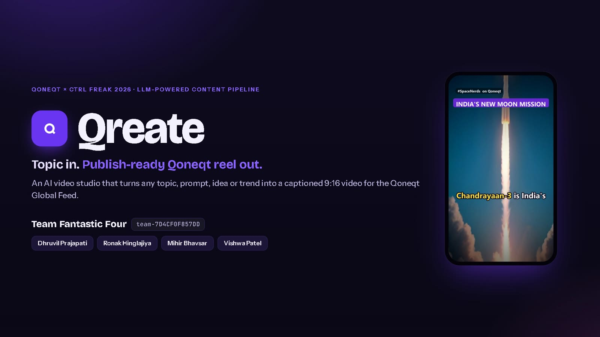

---

## Contents

| | | |
|---|---|---|
| **Overview**<br>[Team](#team)<br>[Demo](#demo)<br>[At a glance](#at-a-glance)<br>[The problem and our answer](#the-problem-and-our-answer)<br>[Features, with screenshots](#features-with-screenshots)<br>[Sample output](#sample-output) | **How it's built**<br>[How it works](#how-it-works)<br>[The LLM layer](#the-llm-layer)<br>[The media engine](#the-media-engine)<br>[Jobs, edits and caching](#jobs-edits-and-caching)<br>[Architecture](#architecture)<br>[Tech stack](#tech-stack) | **Use and run it**<br>[Quick start](#quick-start)<br>[Using the studio](#using-the-studio)<br>[Command line](#command-line)<br>[Configuration](#configuration)<br>[API reference](#api-reference)<br>[What you get](#what-you-get)<br>[Quality checks](#quality-checks)<br>[Testing](#testing)<br>[Deployment](#deployment)<br>[Optional: Wan 2.1](#optional-wan-21-local-text-to-video)<br>[Project layout](#project-layout)<br>[Troubleshooting](#troubleshooting)<br>[Responsible AI and security](#responsible-ai-and-security)<br>[Limitations and roadmap](#limitations-and-roadmap) |

---

## Team

| | |
|---|---|
| 👥 **Team** | Fantastic Four |
| 🔑 **Team code** | `team-7D4CF0F857DD` |
| 🧑‍💻 **Members** | Dhruvil Prajapati · Ronak Hinglajiya · Mihir Bhavsar · Vishwa Patel |
| 🏁 **Challenge** | Qoneqt × CTRL FREAK 2026: LLM-Powered Content Pipeline |
| 🎥 **Demo video** | [youtu.be/41FZuaFv9hQ](https://youtu.be/41FZuaFv9hQ) |
| 📱 **Our reel on Qoneqt** | [qoneqt.com/qlips/8080](https://qoneqt.com/qlips/8080) |
| 💻 **Repository** | [dhruvil1309/Qreate-AI-powered-videos-made-simple](https://github.com/dhruvil1309/Qreate-AI-powered-videos-made-simple) |

---

## Demo

### ▶ Watch our reel on Qoneqt

<p align="center">
  <a href="https://qoneqt.com/qlips/8080"></a>
</p>

**Qoneqt video link:** <https://qoneqt.com/qlips/8080>

This is our **customised, LLM-generated video**, made end to end with Qreate and published on Qoneqt:
- the LLM agents researched the topic, wrote the script and critiqued it;
- the pipeline generated the visuals and the voice, then edited, captioned and quality-checked the reel;
- we published the final reel as a Qoneqt Qlip.

### 🎥 Demo video

<p align="center">
  <a href="https://youtu.be/41FZuaFv9hQ" title="Watch the Qreate demo on YouTube">
    
  </a>
  <br><br>
  <a href="https://youtu.be/41FZuaFv9hQ"></a>
  <br>
  <sub>👆 Click the preview to play the full demo on YouTube · <a href="https://youtu.be/41FZuaFv9hQ">youtu.be/41FZuaFv9hQ</a></sub>
</p>

### 📡 See it in action

<table>
  <tr>
    <td align="center" width="34%">
      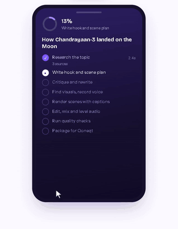<br>
      <sub><b>A real build, streamed live</b><br>(time-lapse of the actual job)</sub>
    </td>
    <td align="center" width="66%">
      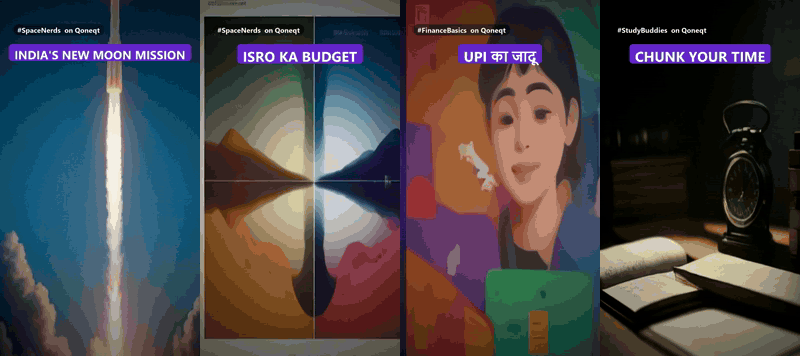<br>
      <sub><b>Four reels made by Qreate</b><br>English · Hinglish · Hindi · English</sub>
    </td>
  </tr>
</table>

---

## At a glance

| | | | |
|:---:|:---:|:---:|:---:|
| 🧭 **8**<br><sub>pipeline stages, topic to package</sub> | 🤖 **3**<br><sub>LLM agents: research, script, critic</sub> | 🔀 **4**<br><sub>LLM providers behind one router</sub> | 🗣️ **3**<br><sub>languages: English, Hindi, Hinglish</sub> |
| 🎯 **6**<br><sub>critic rubric criteria, pass mark 7.5</sub> | ✅ **10**<br><sub>automated QA checks (6 blocking)</sub> | 📱 **1080×1920**<br><sub>H.264/AAC, 30 fps, −14 LUFS</sub> | ⏱️ **~4 min**<br><sub>per 30-second reel on free tiers</sub> |
| 📦 **50**<br><sub>topics per batch request</sub> | ✂️ **1 scene**<br><sub>re-rendered per edit, not the whole reel</sub> | 🔑 **0**<br><sub>API keys needed to run</sub> | 🧪 **21 + 74**<br><sub>pytest tests + UAT cases passing</sub> |

---

## The problem and our answer

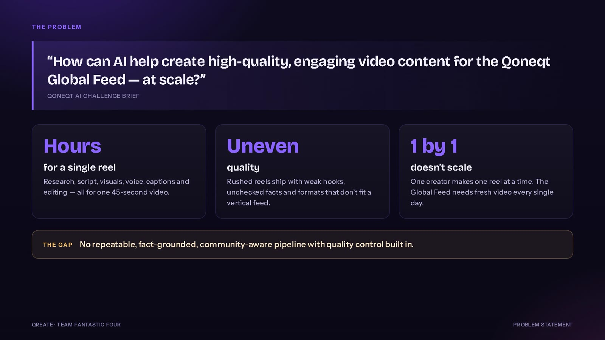

Qoneqt asked how AI can turn ideas into engaging videos for the Global Feed **at scale**.

- **Hours per reel.** Research, scripting, finding visuals, recording a voice, editing and captioning are all manual.
- **Uneven quality.** Nothing checks the hook, the facts, the pacing or the format before a post goes out.
- **One by one doesn't scale.** Each new topic restarts the whole process from scratch.

**The gap:** no repeatable, fact-grounded, community-aware pipeline with quality control built in.
Qreate is that pipeline.

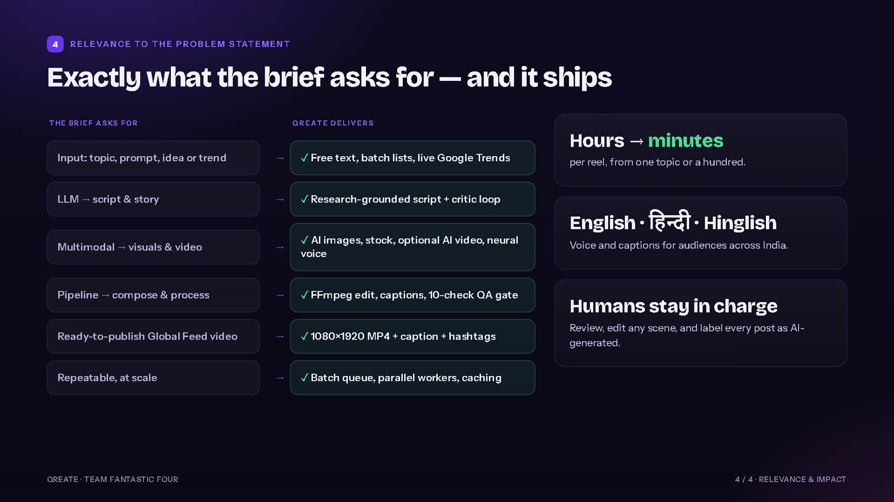

| The brief asks for | Qreate delivers | Where |
|---|---|---|
| Input: a topic, prompt, idea or trend | Free text, batch lists of up to 50 topics, live Google Trends for India | Composer, `/api/batch`, `/api/trends` |
| An LLM that writes the script and story | Research-grounded script agent with a critic agent and a rewrite loop | [The LLM layer](#the-llm-layer) |
| Multimodal models for visuals and video | AI images, stock footage, optional local AI video, neural voices | [The media engine](#the-media-engine) |
| A pipeline that composes and processes | FFmpeg edit, word-synced captions, loudness levelling, 10-check QA gate | [How it works](#how-it-works) |
| Ready-to-publish Global Feed video | 1080×1920 MP4 + thumbnail + title, description and hashtags, zipped | [What you get](#what-you-get) |
| Repeatable, at scale | Batch queue, parallel workers, scene-level caching, jobs saved on disk | [Jobs, edits and caching](#jobs-edits-and-caching) |

**Humans stay in charge.** Every reel can be reviewed and edited scene by scene before posting, and every
post carries a reminder to label it as AI-generated.

---

## Features, with screenshots

### 🎛️ The studio

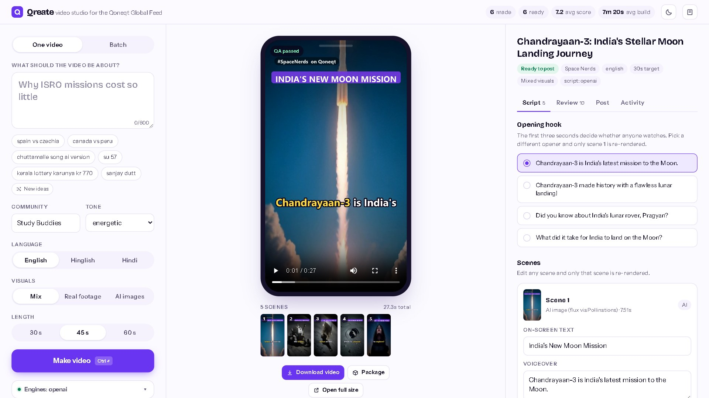

The studio has three columns. On the left you **create**, in the middle a **phone preview** plays the reel,
and on the right you **inspect and edit** the selected video. The header shows totals: videos made, ready,
average critic score and average build time.

### ✍️ Create: one video or a batch

<table>
  <tr>
    <td width="50%">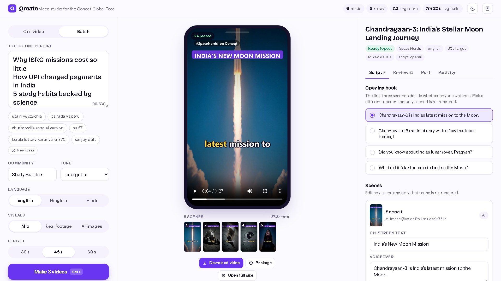</td>
    <td width="50%">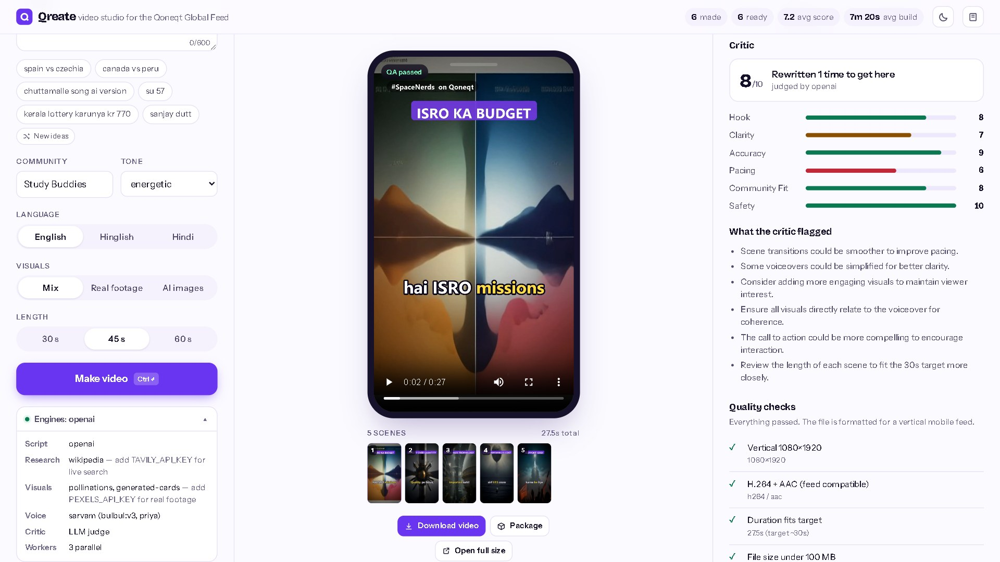</td>
  </tr>
  <tr>
    <td><sub><b>Batch mode:</b> one topic per line becomes a queue of videos ("Make 3 videos").</sub></td>
    <td><sub><b>Engines panel:</b> which script, research, visual and voice engines are live, with hints for keys you could add.</sub></td>
  </tr>
</table>

- **Topic box:** any topic, prompt, idea or trend, up to 600 characters.
- **Trending chips:** live Google Trends for India. **New ideas** fetches a fresh set.
- **Community:** pick or type a Qoneqt community (Study Buddies, Space Nerds, Tech Talk, Finance Basics, Health & Fitness, …).
- **Tone:** energetic, calm and clear, funny, inspiring, or serious explainer.
- **Language:** English, Hinglish (Roman script) or Hindi (Devanagari).
- **Visuals:** **Mix** lets the script choose per scene, **Real footage** prefers stock, **AI images** prefers generated art.
- **Length:** 30, 45 or 60 seconds. The API accepts anything from 20 to 90.
- **Shortcuts:** `Ctrl`/`⌘` + `Enter` submits from anywhere; `/` jumps to the topic box.

### 📡 Watch it build, live

<table>
  <tr>
    <td width="62%">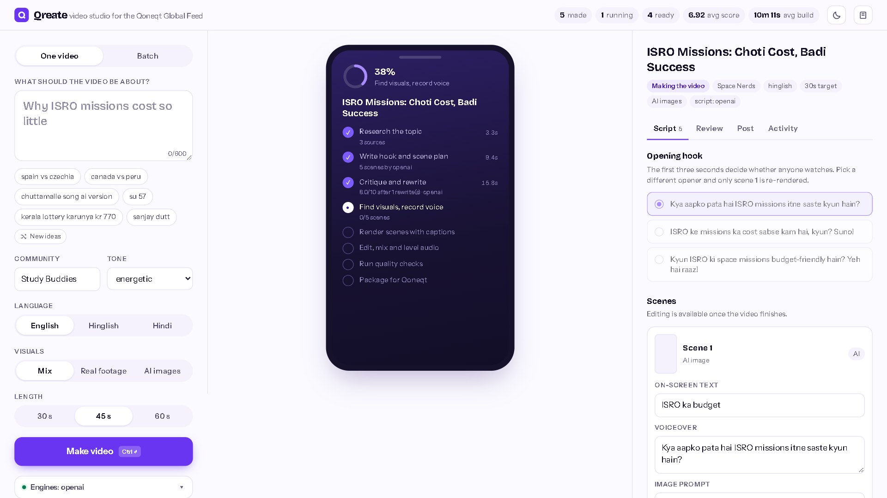</td>
    <td width="38%">
      Progress streams over <b>Server-Sent Events</b>, with no page refresh and no polling.<br><br>
      The phone shows a progress ring, the running stage, and every finished stage with its <b>real duration</b>
      and result (for example "3 sources", "5 scenes by openai", "8.0/10 after 1 rewrite").<br><br>
      The script, including its alternative hooks, appears on the right as soon as it's written, before any media exists.
    </td>
  </tr>
</table>

### 🎬 Play, jump to any scene, preview one scene

<table>
  <tr>
    <td width="50%">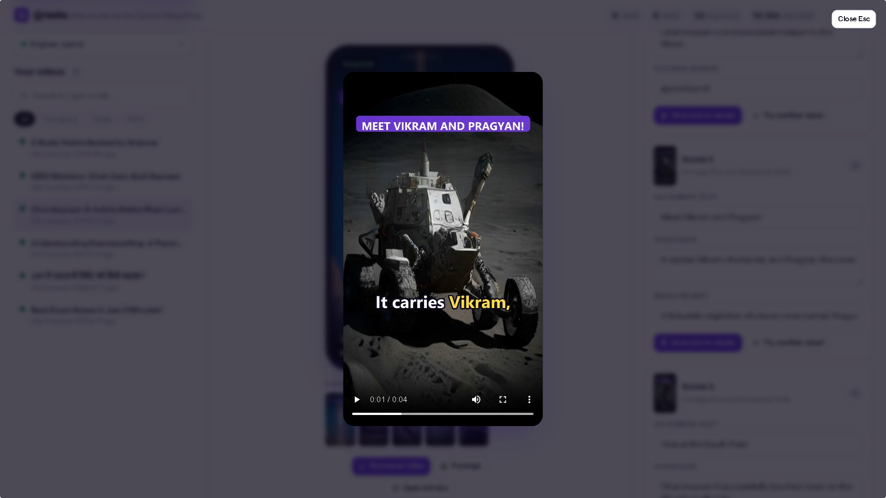</td>
    <td width="50%">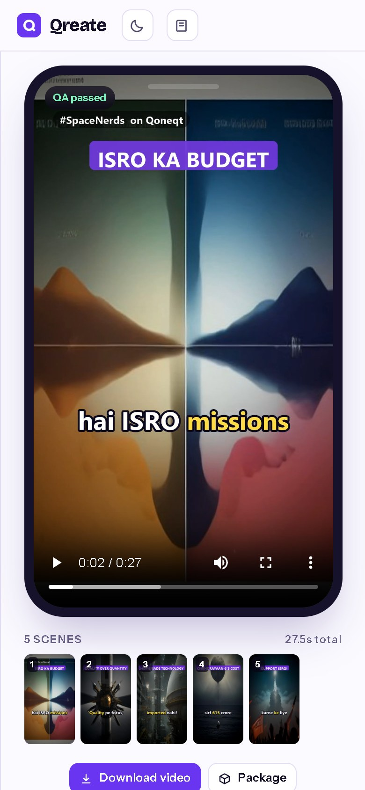</td>
  </tr>
  <tr>
    <td><sub><b>Single-scene preview:</b> click any scene thumbnail in the Script tab to play that scene alone.</sub></td>
    <td><sub><b>Works on phones:</b> the layout reflows for small screens.</sub></td>
  </tr>
</table>

- The finished reel plays in the phone frame with a **QA badge** ("QA passed" or "N warnings").
- The **scene strip** shows a thumbnail per scene. Click one to jump the player to that scene.
- Buttons: **Download video**, **Package** (ZIP), **Open full size**.

### 🧐 Review: the critic's scores and the QA checklist

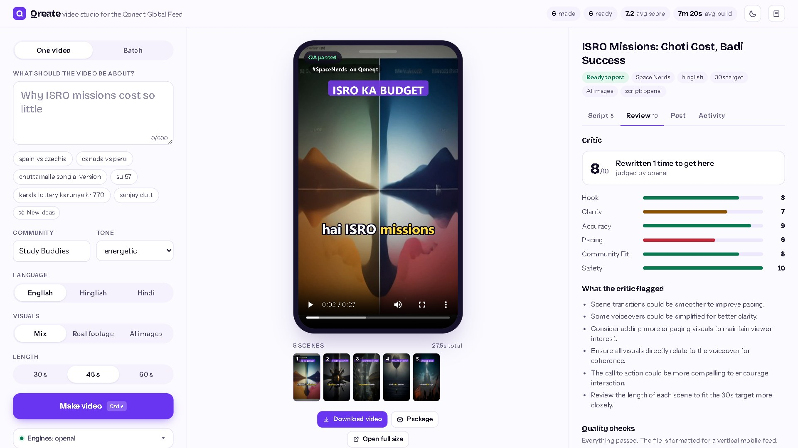

- **Overall score**, how many rewrites it took ("Rewritten 1 time to get here" or "Approved on the first pass"), and which model judged it.
- **Six rubric bars:** hook, clarity, accuracy, pacing, community fit and safety. Bars are coloured good (≥ 8), mid (≥ 6.5) or poor.
- **What the critic flagged:** up to 6 concrete fixes.
- **Quality checks:** all 10 checks with their measured values. Advisory checks are tagged so they're not mistaken for blockers.

### ✏️ Edit any scene, re-render only that scene

- **Opening hook:** pick one of the script agent's alternative hooks. Only scene 1's narration is re-recorded.
- **Per scene:** edit the on-screen text, the narration, and the image prompt or footage search, then **Save and re-render**.
- **Try another visual:** re-rolls just that scene's visual with a new seed or the next search result.
- Edits in progress are flagged "Unsaved" and kept while you type. Live progress updates never overwrite them.

### 📣 Post: publish-ready copy, no re-render

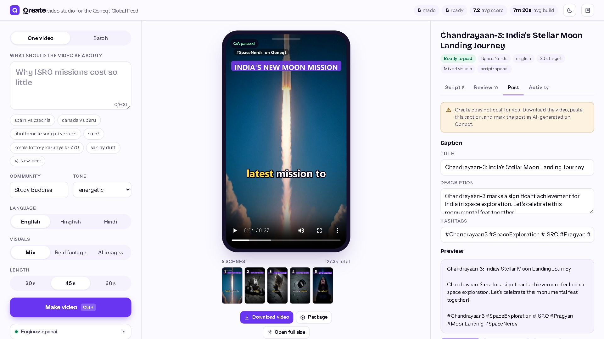

- Edit the **title, description and hashtags**, and see a live preview of the caption.
- **Save copy** rewrites `post.txt`, `plan.json` and the ZIP package **without touching the video**.
- **Copy caption**, download links, a step-by-step posting guide, and the research **sources**.
- A reminder to **label the post as AI-generated** on Qoneqt.

### ⏱️ Activity: real timings for every stage

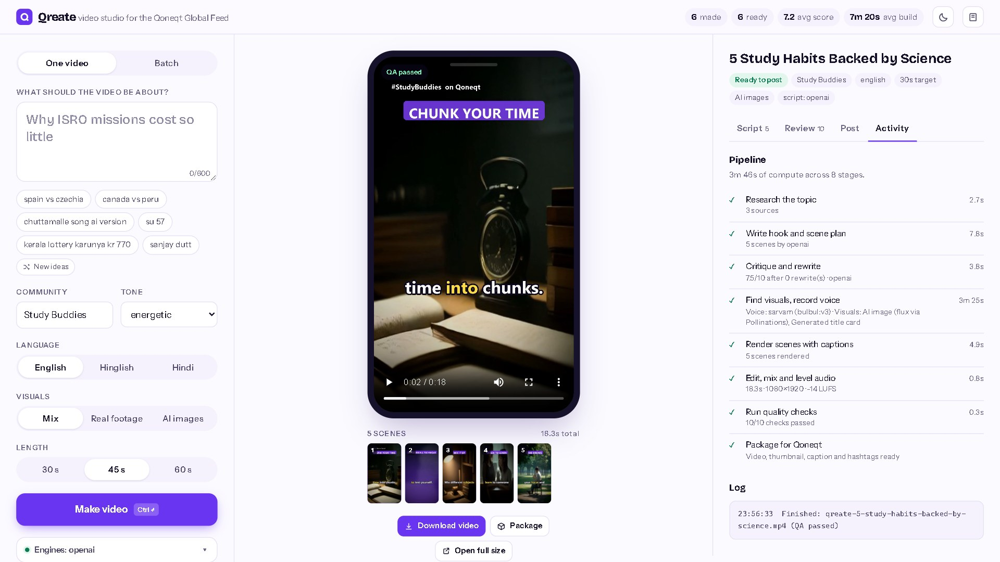

### 🗂️ Library, filters and dark mode

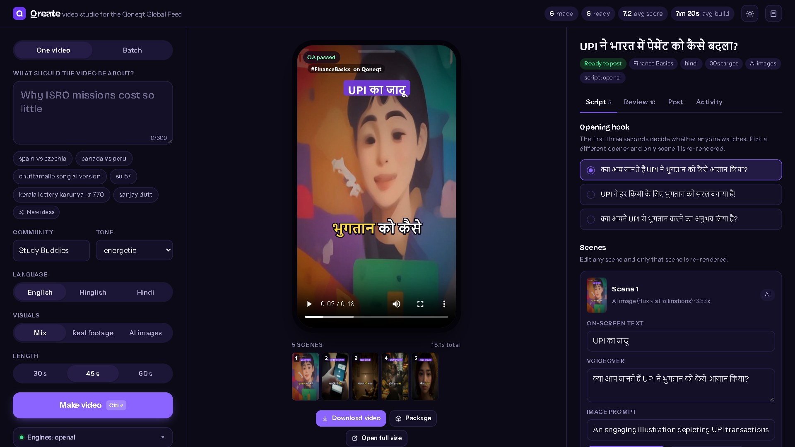

- **Your videos:** search by title or topic; filter by All, In progress, Ready or Failed.
- **Retry** a failed job, or **delete** a job together with its files.
- **Light and dark themes:** follows your system setting and remembers your choice.

---

## Sample output

Every image below is a frame from a reel Qreate made end to end: script, visuals, voice, captions and edit.

<table>
  <tr>
    <td align="center">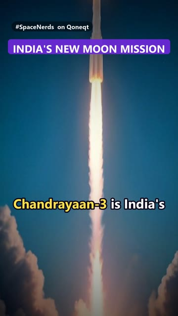</td>
    <td align="center">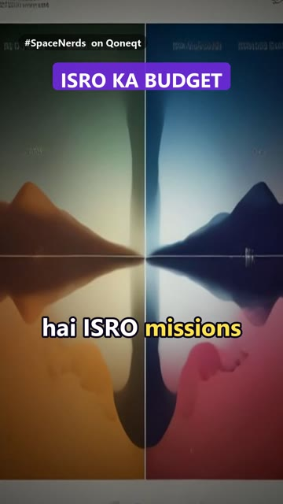</td>
    <td align="center"></td>
    <td align="center"></td>
  </tr>
  <tr>
    <td align="center"><sub><b>English</b> · Space Nerds<br>"Chandrayaan-3: India's Stellar Moon Landing Journey"<br>27.3 s · AI images</sub></td>
    <td align="center"><sub><b>Hinglish</b> · Space Nerds<br>"ISRO Missions: Choti Cost, Badi Success"<br>27.5 s · critic 8.0 · 10/10 QA</sub></td>
    <td align="center"><sub><b>हिन्दी</b> · Finance Basics<br>"UPI ने भारत में पेमेंट को कैसे बदला?"<br>18.1 s · AI images</sub></td>
    <td align="center"><sub><b>English</b> · Study Buddies<br>"5 Study Habits Backed by Science"<br>18.3 s · 10/10 QA</sub></td>
  </tr>
</table>

**One reel, scene by scene:** each scene has its own visual, a headline, and captions that highlight the word
being spoken.

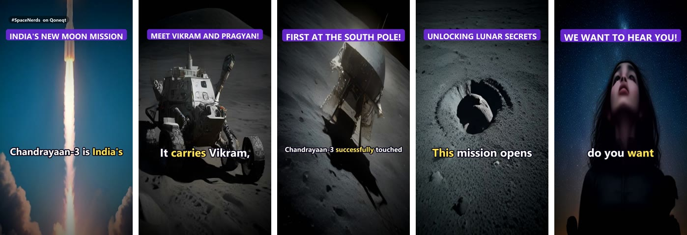

---

## How it works

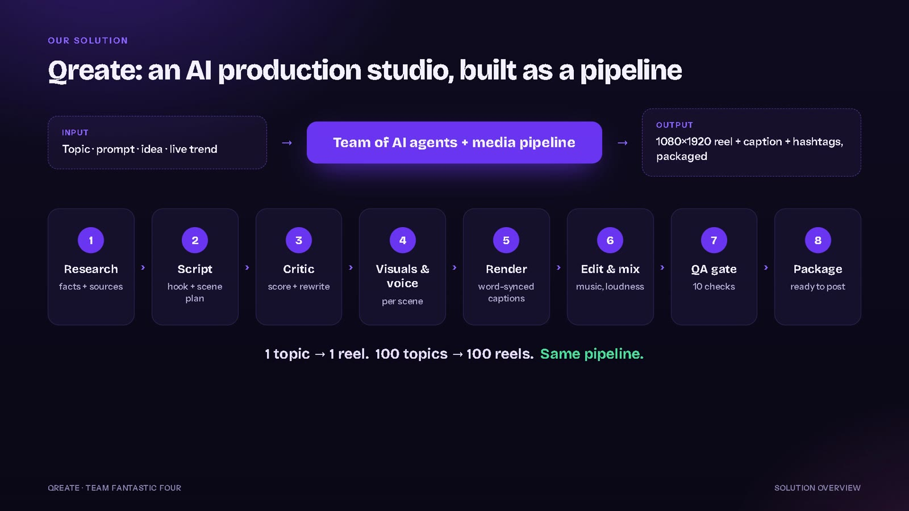

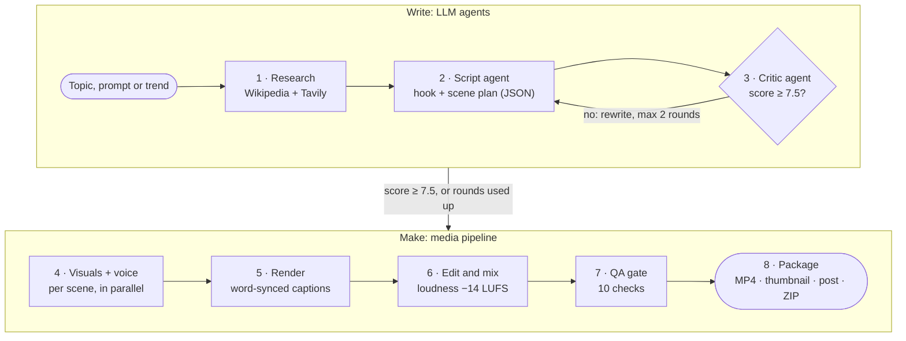
```mermaid
flowchart TB
    subgraph W["Write: LLM agents"]
        direction LR
        A(["Topic, prompt or trend"]) --> R["1 · Research<br/>Wikipedia + Tavily"]
        R --> S["2 · Script agent<br/>hook + scene plan (JSON)"]
        S --> C{"3 · Critic agent<br/>score ≥ 7.5?"}
        C -- "no: rewrite, max 2 rounds" --> S
    end
    subgraph M["Make: media pipeline"]
        direction LR
        V["4 · Visuals + voice<br/>per scene, in parallel"] --> RN["5 · Render<br/>word-synced captions"]
        RN --> E["6 · Edit and mix<br/>loudness −14 LUFS"]
        E --> Q["7 · QA gate<br/>10 checks"]
        Q --> P(["8 · Package<br/>MP4 · thumbnail · post · ZIP"])
    end
    W -- "score ≥ 7.5, or rounds used up" --> M
```

| # | Stage (as shown in the studio) | What happens | Output |
|:-:|---|---|---|
| 1 | **Research the topic** | Wikipedia's top 3 matching articles, plus Tavily web search when a key is set. Up to 8 notes with source links. | `notes.json` |
| 2 | **Write hook and scene plan** | The script agent writes the hook, alternative hooks and a scene-by-scene plan as strict JSON. | `plan.json` |
| 3 | **Critique and rewrite** | The critic scores 6 criteria. Below 7.5 the script is rewritten with the critic's fixes, up to 2 rounds. | critique in `job.json` |
| 4 | **Find visuals, record voice** | Every scene gets a visual and a narration track, 4 scenes at a time, with caching. | `scenes/NN/assets.json` |
| 5 | **Render scenes with captions** | Background motion, headline, word-highlighted captions and voice are composed per scene, 2 scenes at a time. | `scenes/NN/scene.mp4` |
| 6 | **Edit, mix and level audio** | Scenes are joined, an optional music bed is mixed in, and loudness is normalised. | `output/qreate-<slug>.mp4` |
| 7 | **Run quality checks** | 10 technical and editorial checks; 6 of them decide whether the video is ready. | QA in `job.json` |
| 8 | **Package for Qoneqt** | Thumbnail, `post.txt` and `plan.json` are zipped with the video. | `package.zip` |

### Where the time goes

Measured on a real 30-second English reel ("5 Study Habits Backed by Science") with free-tier providers:

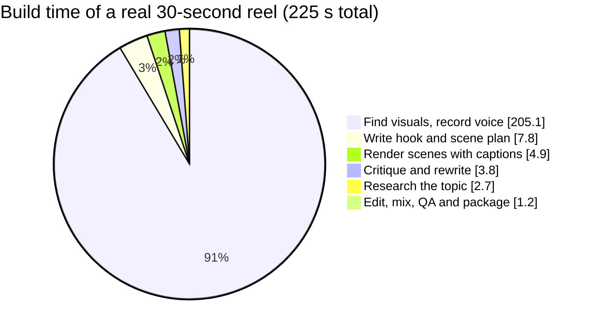
```mermaid
pie showData title Build time of a real 30-second reel (225 s total)
    "Find visuals, record voice" : 205.1
    "Write hook and scene plan" : 7.8
    "Render scenes with captions" : 4.9
    "Critique and rewrite" : 3.8
    "Research the topic" : 2.7
    "Edit, mix, QA and package" : 1.2
```

Over 90% of the build is the visuals-and-voice stage, and almost all of that is waiting for images. The free
Pollinations tier allows roughly **one image every 50 seconds**, so Qreate queues image requests and retries
politely. Research, script and critic together take about 15 seconds; rendering, editing and QA about 6.

### One request, end to end

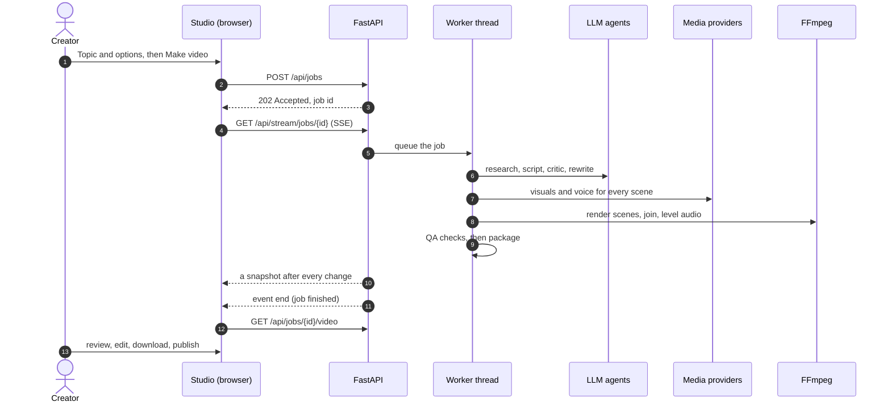
```mermaid
sequenceDiagram
    autonumber
    actor U as Creator
    participant S as Studio (browser)
    participant A as FastAPI
    participant W as Worker thread
    participant L as LLM agents
    participant P as Media providers
    participant F as FFmpeg
    U->>S: Topic and options, then Make video
    S->>A: POST /api/jobs
    A-->>S: 202 Accepted, job id
    S->>A: GET /api/stream/jobs/{id} (SSE)
    A->>W: queue the job
    W->>L: research, script, critic, rewrite
    W->>P: visuals and voice for every scene
    W->>F: render scenes, join, level audio
    W->>W: QA checks, then package
    A-->>S: a snapshot after every change
    A-->>S: event end (job finished)
    S->>A: GET /api/jobs/{id}/video
    U->>S: review, edit, download, publish
```

---

## The LLM layer

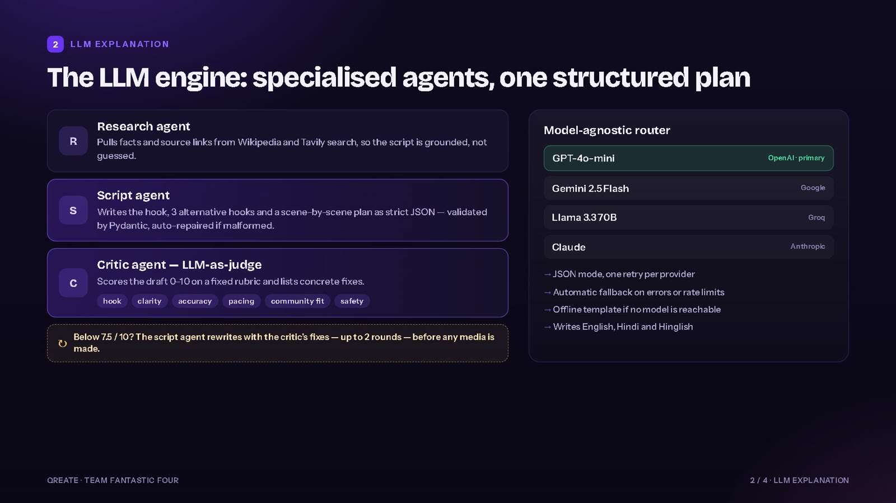

Qreate uses hosted LLMs as **specialised agents** that share one structured plan, the `ScenePlan`. Each agent
has a narrow job and a validated contract, so the output of one is always safe input for the next.

### 🔎 Research agent: grounding

| | |
|---|---|
| **Wikipedia** (always, no key) | Searches for the topic, then fetches the summaries of the top 3 articles (up to 900 characters each) with their links. |
| **Tavily** (optional key) | Adds a search summary and up to 5 fresh web results. Useful for trending topics. |
| **Result** | Up to 8 notes, numbered `[1] title: snippet` in the script prompt. Notes with a URL become the post's **Sources**. |
| **If nothing is found** | The prompt says "no research available, stay general and avoid specific statistics". The stage shows "No live sources". |

### ✍️ Script agent: the story

The script agent writes the whole reel as **one JSON object**. Its brief is sized from the target length:
about **2.4 spoken words per second**, split across `max(4, min(9, round(seconds ÷ 6.5)))` scenes.

| Target | Scenes asked for | Spoken words |
|:-:|:-:|:-:|
| 30 s | 5 | ~72 |
| 45 s | 7 | ~108 |
| 60 s | 9 | ~144 |

**Rules in the system prompt:**
- Scene 1's narration is the **hook**: it must stop the scroll in under 2 seconds with a surprising fact,
  a bold claim, a relatable pain or a direct question. **At most 14 words.** No greetings, no "in this video".
- One idea per scene, short spoken sentences, each scene leading to the next.
- **Use only facts from the research notes.** Otherwise stay general: no invented numbers, names or dates.
- Speak to the target community in its language and tone. The last scene is a **call to action** inviting
  comments or follows on Qoneqt.
- On-screen captions are punchy **2–6 word headlines**, not a copy of the narration.
- Each scene picks a visual: `stock` with a 2–4 word English search query, or `ai_image` with a detailed English
  prompt and no text in the image.
- Safe for a general audience, with no medical, legal or financial advice beyond general education.

**Language rules:** English is simple, conversational Indian English. Hinglish is written **in Roman script
only** ("Never use Devanagari"). Hindi is simple spoken Hindi **in Devanagari**.

**Output contract** (`ScenePlan`): `title`, `hook`, `hook_options` (3 alternatives), 2–12 `scenes`
(`voiceover`, `caption`, `visual`), `cta`, `description` and `hashtags`. Pydantic validates it, and the
code then normalises it:
- scene ids are renumbered
- an unknown visual mode becomes `stock`
- the hook is set to scene 1's narration
- captions are capped at 7 words
- hashtags get a `#`, lose spaces and duplicates, and are capped at 8

### 🧑‍⚖️ Critic agent: LLM-as-judge

The critic scores the draft against the research notes and the target (length, community, language, tone).

| Criterion | The question the critic is given |
|---|---|
| **Hook** | Would a scrolling viewer stop in the first 2 seconds? |
| **Clarity** | Is every scene one clear, easy idea in short spoken sentences? |
| **Accuracy** | Are all factual claims supported by the research notes (no invented stats)? |
| **Pacing** | Does the length fit the target, and does each scene lead to the next? |
| **Community fit** | Do the tone and language fit the target community and language setting? |
| **Safety** | Is it safe, respectful and free of harmful or misleading advice? |

- Each criterion is scored 0–10. **Overall is recomputed by Qreate** as the plain average; the model's own
  overall is ignored. The critic also returns up to 6 concrete fixes.
- **Below 7.5, the script agent rewrites** with the draft and every fix, keeping what works. Then the critic
  scores it again, for **up to 2 rounds**. If the score is still low, the reel continues and the advisory
  QA check "Critic score ≥ 7.5" flags it for a human.

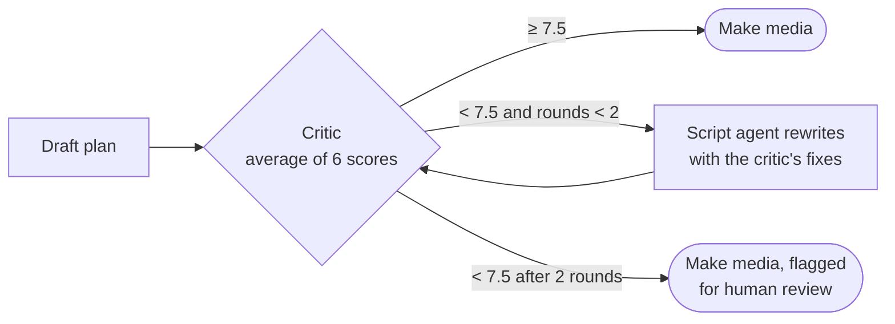
```mermaid
flowchart LR
    D["Draft plan"] --> J{"Critic<br/>average of 6 scores"}
    J -- "≥ 7.5" --> OK(["Make media"])
    J -- "< 7.5 and rounds < 2" --> RW["Script agent rewrites<br/>with the critic's fixes"]
    RW --> J
    J -- "< 7.5 after 2 rounds" --> FL(["Make media, flagged<br/>for human review"])
```

**Without an LLM**, a deterministic heuristic critic scores the plan instead. It never triggers rewrites:

| Criterion | Heuristic rule |
|---|---|
| Hook | 9 if ≤ 14 words, minus 0.5 per extra word (min 4); minus 3 for openers like "Hi" or "In this video" |
| Pacing | 9 if total words are 70–125% of the target, else 6 |
| Clarity | 9, minus 1 per caption over 6 words, minus 1 if any scene is over 40 words |
| Community fit | 8 with a call to action, else 6.5 |
| Accuracy | 8 with research sources, else 7 |
| Safety | 9 |

### 🔀 Model-agnostic router

| Provider | Default model | JSON mode |
|---|---|---|
| OpenAI | `gpt-4o-mini` | `response_format: json_object` |
| Google Gemini | `gemini-2.5-flash` | `responseMimeType: application/json` |
| Groq | `llama-3.3-70b-versatile` | `response_format: json_object` |
| Anthropic | `claude-sonnet-4-6` | "Respond with a single JSON object only" |

- Providers are tried in `LLM_ORDER` (default `gemini,groq,openai,anthropic`), skipping any without a key.
  Our demo runs GPT-4o-mini first.
- **HTTP errors** (bad key, rate limit, outage) move straight to the next provider. **Other failures**, such as
  timeouts or malformed JSON, get one retry first.
- Replies are parsed defensively: code fences are stripped, and if needed the outermost `{…}` is extracted.
- **Temperatures:** writing 0.8 (creative), rewriting 0.6, judging 0.2 (consistent).
- If no provider answers, the script falls back to an **offline template** and the critic to the heuristic,
  so the pipeline always completes.

> **Offline template:** a deterministic plan of 3–5 scenes: a hook built from the topic, up to three
> research facts (or three generic steps), and a call to action. It has language-specific hooks and captions
> for English, Hinglish and Hindi.

---

## The media engine

### 🖼️ Visuals: one chain per style

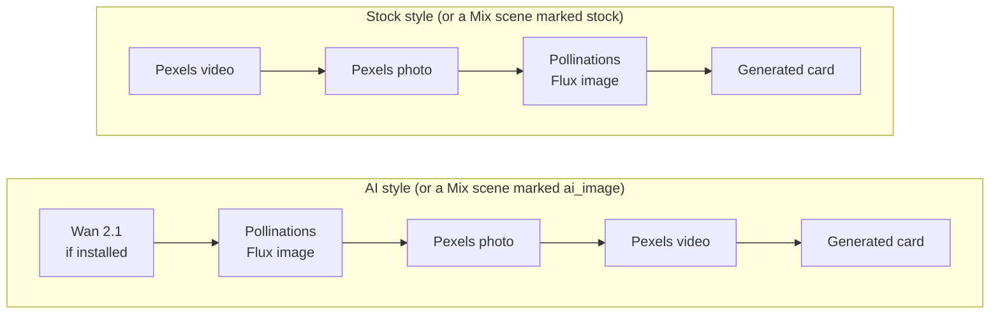
```mermaid
flowchart LR
    subgraph AI["AI style (or a Mix scene marked ai_image)"]
        direction LR
        W1["Wan 2.1<br/>if installed"] --> P1["Pollinations<br/>Flux image"] --> X1["Pexels photo"] --> Y1["Pexels video"] --> C1["Generated card"]
    end
    subgraph ST["Stock style (or a Mix scene marked stock)"]
        direction LR
        X2["Pexels video"] --> Y2["Pexels photo"] --> P2["Pollinations<br/>Flux image"] --> C2["Generated card"]
    end
```

| Source | How Qreate uses it |
|---|---|
| **Pollinations Flux** (no key) | 1080×1920 image from the scene prompt, plus "vertical 9:16 composition, high detail, cinematic lighting, no text, no watermark". The seed is fixed per job and scene, so results are reproducible. Requests are queued one at a time and retried on rate limits (6 × 15 s). |
| **Pexels** (free key) | Portrait video search, keeping the file closest to 1920 px tall, or a portrait photo. Credits are kept ("Pexels video by …"). |
| **Wan 2.1 T2V-1.3B** (optional) | Local text-to-video in a subprocess, 832×480 cropped to fill 9:16. See [Wan 2.1](#optional-wan-21-local-text-to-video). |
| **Generated card** (always) | A 1080×1920 gradient with soft glows and rings in one of 6 palettes. The caption overlay supplies the text. |

Each scene records the source it actually used, and the studio shows it on the scene card, for example
"AI image (flux via Pollinations) · 7.51s".

### 🗣️ Voice: Indian voices first

| Engine | When | Word timing |
|---|---|---|
| **Sarvam AI Bulbul v3** (speaker `priya`) | `TTS_PROVIDER=sarvam` and a key | Estimated from word length |
| **Microsoft Edge neural TTS** | Default, internet access, no key | **Exact**, from the engine's word boundaries |
| **eSpeak NG** | Installed locally, offline | Estimated |
| **Silent track** | Last resort, so the edit still completes | Estimated |

Edge voices: `en-IN-NeerjaNeural` (English), `en-IN-PrabhatNeural` (Hinglish), `hi-IN-SwaraNeural` (Hindi).
Sarvam uses `en-IN` for English and `hi-IN` for Hindi and Hinglish.

### 💬 Captions: word by word

- Captions are drawn with **Pillow** as transparent 1080×1920 overlays. They don't depend on subtitle
  renderers, so Hindi works the same way as English.
- Narration is split into chunks of **up to 3 words**, breaking at punctuation. **One caption frame per spoken
  word** highlights the current word in **yellow**, with a dark outline for contrast on any background.
- Every scene carries its **headline** in a purple box near the top. The first scene also shows a
  `#Community on Qoneqt` tag.
- Font sizes shrink automatically to fit, and long headlines wrap onto balanced lines.
- Fonts are found automatically on Linux, Windows and macOS: DejaVu or Segoe UI for Latin text, and Noto
  Devanagari or Nirmala UI for Hindi.

### 🎞️ Edit and mix

| Step | Detail |
|---|---|
| Background | Video is scaled and cropped to fill 9:16. Images get a slow Ken Burns-style **pan** (alternating direction per scene) and a soft vignette. |
| Scene length | Narration + 0.3 s, plus 0.9 s more on the last scene so the call to action can land. |
| Scene encode | H.264 (`libx264`, CRF 21, veryfast, yuv420p, 30 fps) and AAC 160 kb/s, 48 kHz stereo. |
| Join | Scenes are concatenated without re-encoding, so the join is fast and lossless. |
| Music (optional) | Any `.mp3`, `.wav`, `.m4a` or `.ogg` in `assets/music/` is looped under the voice at 10% volume and faded out over the last 1.5 s. None is bundled, so reels are voice-only by default. |
| Loudness | `loudnorm` to **−14 LUFS** integrated, −1.5 dBTP true peak and LRA 11, the usual target for social feeds. |
| Delivery | `+faststart` MP4, so playback starts before the download finishes. A thumbnail is taken at 0.9 s. |

---

## Jobs, edits and caching

### Job lifecycle

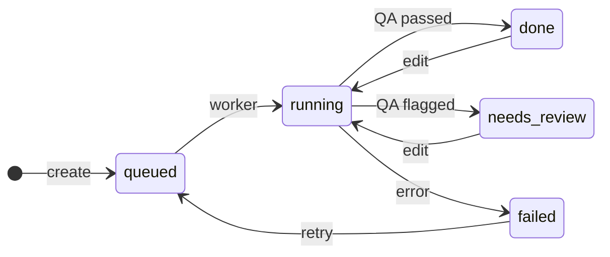
```mermaid
stateDiagram-v2
    direction LR
    [*] --> queued: create
    queued --> running: worker
    running --> done: QA passed
    running --> needs_review: QA flagged
    running --> failed: error
    done --> running: edit
    needs_review --> running: edit
    failed --> queued: retry
```

- **`done`**: all 6 blocking QA checks passed. **`needs_review`**: the video exists but a blocking check
  failed. Packaging still runs, so you can inspect everything.
- **Edit** means a scene edit or a hook swap. Any job that isn't queued or running can be **deleted**, along
  with its files.
- Jobs are saved to disk after every change. After a server restart, finished jobs are all still there, and a job
  that was interrupted mid-build is marked **failed** with a clear message. **Retry** runs it again from a clean
  folder.

### What an edit redoes

Qreate redoes only the work an edit invalidates:

| You change… | Re-recorded or re-fetched | Re-rendered | Also redone |
|---|---|---|---|
| **Post copy** (title, description, hashtags) | nothing | nothing | `post.txt`, `plan.json`, ZIP |
| **Opening hook** | scene 1 narration | scene 1 | join, QA, package |
| **A scene's caption** | nothing | that scene | join, QA, package |
| **A scene's narration** | that scene's voice | that scene | join, QA, package |
| **A scene's prompt or search** | that scene's visual | that scene | join, QA, package |
| **Try another visual** | that scene's visual (new seed or next result) | that scene | join, QA, package |

The critic does not re-run after an edit: the human editor is the judge at that point.

### Caching

- **Per scene:** `assets.json` remembers each scene's visual and voice; they are reused unless the edit
  changes them.
- **Render key:** each `scene.mp4` has a `render.key` fingerprint (assets, caption, duration and community).
  Scenes whose fingerprint is unchanged are not rendered again.
- **Shared cache** (`data/cache/`): downloaded Pexels media and generated images, keyed by query or prompt and
  seed, so repeated requests skip the network.

### Concurrency

| Level | Default |
|---|---|
| Jobs at the same time | 2 (`MAX_WORKERS`) |
| Scenes fetching visuals and voice, per job | 4 |
| Scenes rendering, per job | 2 |
| Pollinations requests | 1 at a time, shared across all jobs (free-tier rate limit) |

---

## Architecture

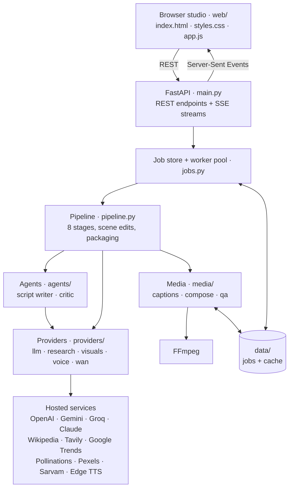
```mermaid
flowchart TB
    UI["Browser studio · web/<br/>index.html · styles.css · app.js"]
    API["FastAPI · main.py<br/>REST endpoints + SSE streams"]
    ST["Job store + worker pool · jobs.py"]
    PL["Pipeline · pipeline.py<br/>8 stages, scene edits, packaging"]
    AG["Agents · agents/<br/>script writer · critic"]
    PR["Providers · providers/<br/>llm · research · visuals · voice · wan"]
    MD["Media · media/<br/>captions · compose · qa"]
    EXT["Hosted services<br/>OpenAI · Gemini · Groq · Claude<br/>Wikipedia · Tavily · Google Trends<br/>Pollinations · Pexels · Sarvam · Edge TTS"]
    FF["FFmpeg"]
    DISK[("data/<br/>jobs + cache")]
    UI -- "REST" --> API
    API -- "Server-Sent Events" --> UI
    API --> ST
    ST --> PL
    ST <--> DISK
    PL --> AG
    PL --> PR
    PL --> MD
    AG --> PR
    PR --> EXT
    MD --> FF
    MD <--> DISK
```

- **One Python process.** The API answers immediately (`202`) and hands work to a thread pool. FFmpeg runs as
  a subprocess, and so does Wan when enabled.
- **Live updates:** every change to the job store bumps a revision counter. The SSE endpoints check it every
  0.35 s and push a fresh snapshot. A keepalive goes out every 15 s, and per-job streams end with
  `event: end` (or `event: gone` if the job is deleted).
- **Storage:** one folder per job with an atomic `job.json`, written to a temp file and then renamed. There is
  no database.
- **Front end:** plain HTML, CSS and JavaScript. Panels are patched in place rather than rebuilt, so focus and
  typing survive live updates.

### Data model

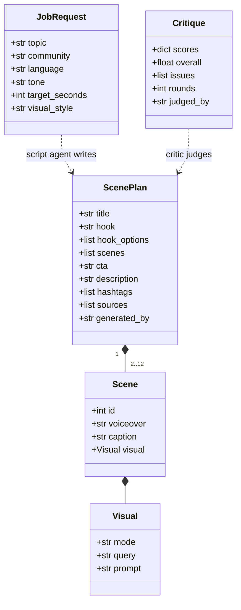
```mermaid
classDiagram
    class JobRequest {
        +str topic
        +str community
        +str language
        +str tone
        +int target_seconds
        +str visual_style
    }
    class ScenePlan {
        +str title
        +str hook
        +list hook_options
        +list scenes
        +str cta
        +str description
        +list hashtags
        +list sources
        +str generated_by
    }
    class Scene {
        +int id
        +str voiceover
        +str caption
        +Visual visual
    }
    class Visual {
        +str mode
        +str query
        +str prompt
    }
    class Critique {
        +dict scores
        +float overall
        +list issues
        +int rounds
        +str judged_by
    }
    JobRequest ..> ScenePlan : script agent writes
    ScenePlan "1" *-- "2..12" Scene
    Scene *-- Visual
    Critique ..> ScenePlan : critic judges
```

---

## Tech stack

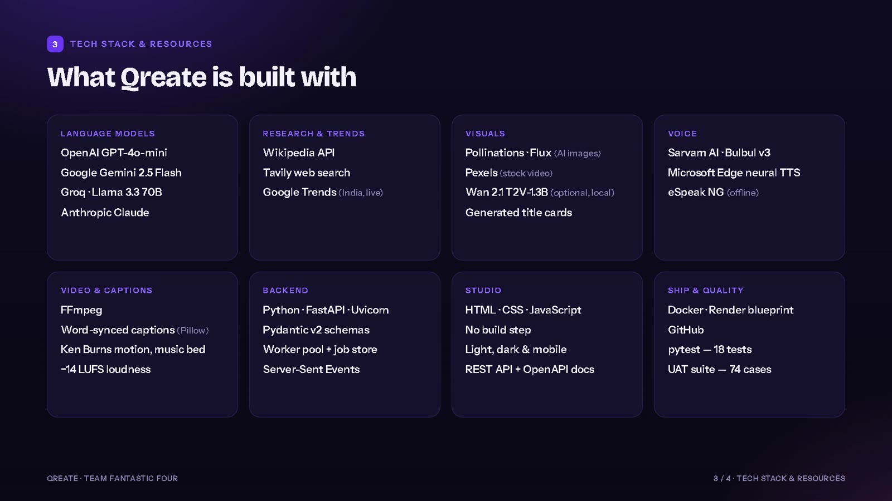

| Area | Tools | Why we chose it |
|---|---|---|
| 🤖 Language models | OpenAI GPT-4o-mini · Google Gemini 2.5 Flash · Groq Llama 3.3 70B · Anthropic Claude | Fast, cheap JSON-capable models; four providers means no single point of failure |
| 🔎 Research and trends | Wikipedia API · Tavily search · Google Trends RSS (India) | Free, citable grounding; live trends for topic ideas |
| 🖼️ Visuals | Pollinations Flux · Pexels · Wan 2.1 T2V-1.3B (optional) · generated cards | Free AI images and stock with no setup; local AI video for capable GPUs |
| 🗣️ Voice | Sarvam AI Bulbul v3 · Microsoft Edge neural TTS · eSpeak NG | Natural Indian voices, with free and offline fallbacks |
| 🎞️ Video and captions | FFmpeg · Pillow | Full control of the edit; captions that render Hindi correctly |
| ⚙️ Backend | Python · FastAPI · Uvicorn · Pydantic v2 · thread pool · Server-Sent Events | Typed contracts between agents; simple, live, dependency-light |
| 🖥️ Studio | HTML · CSS · JavaScript | No build step; loads instantly from the same server |
| 🚢 Ship and quality | Docker · Render Blueprint · pytest · headless-browser UAT | One-command deploys; 21 tests and 74 acceptance cases |

---

## Quick start

> **You need:** Python 3.11+ and [FFmpeg](https://ffmpeg.org/download.html) on your `PATH`
> (check with `ffmpeg -version` in a new terminal). Nothing else is required.

<details open>
<summary><b>🪟 Windows (PowerShell)</b></summary>

```powershell
git clone https://github.com/dhruvil1309/Qreate-AI-powered-videos-made-simple.git
cd Qreate-AI-powered-videos-made-simple
py -3.11 -m venv .venv
.\.venv\Scripts\Activate.ps1
python -m pip install -r requirements.txt
Copy-Item .env.example .env
uvicorn app.main:app --reload
```

If PowerShell blocks activation, run `Set-ExecutionPolicy -Scope CurrentUser RemoteSigned` once, or start it
directly with `.\.venv\Scripts\python.exe -m uvicorn app.main:app --reload`.

</details>

<details>
<summary><b>🍎 macOS / 🐧 Linux</b></summary>

```bash
git clone https://github.com/dhruvil1309/Qreate-AI-powered-videos-made-simple.git
cd Qreate-AI-powered-videos-made-simple
python3 -m venv .venv && source .venv/bin/activate
pip install -r requirements.txt
cp .env.example .env
uvicorn app.main:app --reload
```

</details>

<details>
<summary><b>🐳 Docker</b></summary>

```bash
docker build -t qreate .
docker run --rm -p 8000:8000 --env-file .env -v qreate-data:/app/data qreate
```

The image includes FFmpeg, eSpeak NG, Noto Devanagari fonts and `libraqm`, which correctly joins Hindi letters.

</details>

**Then open:**

| | |
|---|---|
| 🎛️ Studio | <http://127.0.0.1:8000/> |
| 📖 Interactive API docs | <http://127.0.0.1:8000/docs> |
| 💓 Health and active engines | <http://127.0.0.1:8000/api/health> |

### 🔑 Add keys for better results (all optional)

Qreate runs with **no keys at all**, using the offline script, generated cards and local or free voices.
Each key you add to `.env` upgrades one part:

| To get | Set in `.env` |
|---|---|
| LLM-written scripts and an LLM critic | Any of `OPENAI_API_KEY`, `GEMINI_API_KEY`, `GROQ_API_KEY`, `ANTHROPIC_API_KEY` |
| Real stock footage and photos | `PEXELS_API_KEY` (free) |
| Natural Indian-language voices | `SARVAM_API_KEY` and `TTS_PROVIDER=sarvam` |
| Fresher web research for trends | `TAVILY_API_KEY` |

AI images (Pollinations) and Edge voices need no key, only internet access. Restart the server after editing
`.env`, then check the **Engines** panel to confirm what's live.

---

## Using the studio

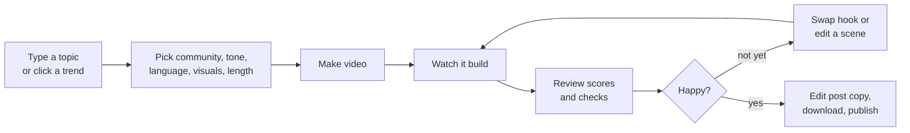
```mermaid
flowchart LR
    A["Type a topic<br/>or click a trend"] --> B["Pick community, tone,<br/>language, visuals, length"]
    B --> C["Make video"]
    C --> D["Watch it build"]
    D --> E["Review scores<br/>and checks"]
    E --> F{"Happy?"}
    F -- "not yet" --> G["Swap hook or<br/>edit a scene"]
    G --> D
    F -- "yes" --> H["Edit post copy,<br/>download, publish"]
```

| Area | What it does |
|---|---|
| **Composer** | One video or a batch; trending chips; community, tone, language, visuals and length; the engines panel |
| **Phone preview** | Live stage progress while building, then the player with its QA badge |
| **Scene strip** | A thumbnail per scene; click to jump the player there |
| **Script tab** | Swap the opening hook; edit any scene's text, narration and visual; "Try another visual"; play one scene alone |
| **Review tab** | Overall score, six rubric bars, what the critic flagged, and the QA checklist |
| **Post tab** | Edit the title, description and hashtags with a live preview; copy the caption; download; see sources |
| **Activity tab** | Per-stage timings, total compute time and the job log |
| **Your videos** | Search, filter by status, retry a failed job, or delete one with its files |

> **Publishing stays manual.** Qreate prepares everything but does not post to Qoneqt. Download the package,
> review it, copy the caption, and mark the post as AI-generated when you publish.

---

## Command line

```powershell
python cli.py "Why ISRO missions cost so little" --community "Space Nerds" --language hinglish --tone energetic --seconds 45 --style mix
python cli.py --batch topics.txt --seconds 40
```

| Argument | Default | Description |
|---|---|---|
| `topic` | | One topic, prompt, idea or trend |
| `--batch FILE` | | Text file with one topic per line |
| `--community` | `General` | Target Qoneqt community |
| `--language` | `english` | `english`, `hinglish` or `hindi` |
| `--tone` | `energetic` | Writing and narration tone |
| `--seconds` | `45` | Target duration, 20–90 |
| `--style` | `mix` | `mix`, `stock` or `ai` |

The CLI runs jobs one after another in the same process, prints every stage as it finishes, and exits with
code 1 if any job fails.

---

## Configuration

Copy `.env.example` to `.env`. Every value is optional and read at startup. **Never commit `.env`.**

<details>
<summary><b>🤖 LLM providers</b></summary>

| Variable | Default | Purpose |
|---|---|---|
| `OPENAI_API_KEY` | | OpenAI provider |
| `OPENAI_MODEL` | `gpt-4o-mini` | OpenAI model |
| `GEMINI_API_KEY` | | Google Gemini provider |
| `GEMINI_MODEL` | `gemini-2.5-flash` | Gemini model |
| `GROQ_API_KEY` | | Groq provider |
| `GROQ_MODEL` | `llama-3.3-70b-versatile` | Groq model |
| `ANTHROPIC_API_KEY` | | Anthropic provider |
| `ANTHROPIC_MODEL` | `claude-sonnet-4-6` | Claude model |
| `LLM_ORDER` | `gemini,groq,openai,anthropic` | Order in which configured providers are tried |

Set `LLM_ORDER=openai,gemini,groq,anthropic` to make GPT-4o-mini primary, as in our demo.

</details>

<details>
<summary><b>🔎 Research</b></summary>

| Variable | Default | Purpose |
|---|---|---|
| `TAVILY_API_KEY` | | Adds fresh web results to the Wikipedia research |

Wikipedia is always tried and needs no key.

</details>

<details>
<summary><b>🖼️ Visuals</b></summary>

| Variable | Default | Purpose |
|---|---|---|
| `PEXELS_API_KEY` | | Portrait stock video and photo search |
| `USE_POLLINATIONS` | `1` | Free AI images, no key |
| `POLLINATIONS_MODEL` | `flux` | Pollinations image model |
| `POLLINATIONS_RETRIES` | `6` | Retries when the free tier rate-limits (HTTP 402/429) |
| `POLLINATIONS_WAIT` | `15` | Seconds between those retries |
| `WAN_ENABLED` | `1` | Use local Wan 2.1 when its files are present |
| `WAN_RUNTIME_DIR` / `WAN_MODEL_DIR` | inside `.venv` | Where Wan's runtime and checkpoints live |

</details>

<details>
<summary><b>🗣️ Voice</b></summary>

| Variable | Default | Purpose |
|---|---|---|
| `TTS_PROVIDER` | `edge` | `sarvam` or `edge` |
| `SARVAM_API_KEY` | | Sarvam Indian-language neural voices |
| `SARVAM_TTS_MODEL` | `bulbul:v3` | Sarvam model |
| `SARVAM_TTS_SPEAKER` | `priya` | Sarvam speaker |
| `SARVAM_TTS_PACE` | `1.0` | Speaking pace |
| `USE_EDGE_TTS` | `1` | Microsoft Edge neural voices, no key |
| `VOICE_ENGLISH` | `en-IN-NeerjaNeural` | Edge voice for English |
| `VOICE_HINGLISH` | `en-IN-PrabhatNeural` | Edge voice for Hinglish |
| `VOICE_HINDI` | `hi-IN-SwaraNeural` | Edge voice for Hindi |

</details>

<details>
<summary><b>⚙️ Pipeline, storage and fonts</b></summary>

| Variable | Default | Purpose |
|---|---|---|
| `DATA_DIR` | `data` | Jobs and cache directory. Use a persistent volume when hosted. |
| `MAX_WORKERS` | `2` | Jobs processed at the same time |
| `CRITIC_THRESHOLD` | `7.5` | Score a script must reach |
| `CRITIC_MAX_ROUNDS` | `2` | Maximum rewrite rounds |
| `CRITIC_USE_LLM` | `1` | `0` uses the heuristic critic, so only the script uses the LLM |
| `OFFLINE_MODE` | `0` | `1` disables every network provider |
| `HTTP_TIMEOUT` | `45` | HTTP timeout for LLM calls, in seconds |
| `FONT_BOLD` | auto | Caption font, found automatically on Linux, Windows and macOS |
| `FONT_DEVANAGARI` | auto | Hindi caption font (Noto on Linux, Nirmala UI on Windows) |

The video format is fixed at 1080×1920 and 30 fps.

</details>

---

## API reference

Full interactive schemas are at **`/docs`** while the server runs.

| Method | Endpoint | Purpose |
|---|---|---|
| `GET` | `/api/health` | Active LLM, research, visual and voice engines; critic mode; FFmpeg; workers; Wan readiness |
| `GET` | `/api/trends?geo=IN` | Up to 12 trending topics, or built-in ideas when trends are unavailable |
| `POST` | `/api/jobs` | Create one video job → `202 {id, status}` |
| `POST` | `/api/batch` | Create up to 50 jobs → `202 {batch_id, ids}`. Every topic is validated before any job is queued. |
| `GET` | `/api/jobs` | The newest 50 jobs with progress, plus stats |
| `GET` | `/api/stats` | Totals: made, ready, running, failed, average score, average build time |
| `GET` | `/api/jobs/{id}` | One job: request, stages, plan, critique, assets, QA, outputs and log |
| `POST` | `/api/jobs/{id}/hook` | Swap the opening line (`index` or `text`); re-records scene 1 only |
| `POST` | `/api/jobs/{id}/scenes/{n}/regenerate` | Edit one scene (`voiceover`, `caption`, `visual_query`, `visual_prompt`, `visual_mode`); an empty body re-rolls the visual |
| `PATCH` | `/api/jobs/{id}/plan` | Edit `title`, `description`, `hashtags`, `cta`; repackages without re-rendering |
| `POST` | `/api/jobs/{id}/retry` | Run a finished or failed job again from a clean folder |
| `DELETE` | `/api/jobs/{id}` | Delete a job and its files |
| `GET` | `/api/stream/jobs` | SSE: the job list and stats after every change |
| `GET` | `/api/stream/jobs/{id}` | SSE: one job until it finishes (`event: end`), or `event: gone` if deleted |
| `GET` | `/api/jobs/{id}/video` | Final MP4 (`?download=true` to download) |
| `GET` | `/api/jobs/{id}/thumbnail` | JPEG thumbnail |
| `GET` | `/api/jobs/{id}/package` | ZIP package |
| `GET` | `/api/jobs/{id}/scenes/{n}/poster` | Still of one scene |
| `GET` | `/api/jobs/{id}/scenes/{n}/clip` | One scene's MP4 on its own |

Status codes:
- **`409`:** you tried to edit, retry or delete a job that is queued or running, or picked the hook that is already in use.
- **`422`:** invalid input.
- **`404`:** an output that isn't ready yet.

<details>
<summary><b>Request examples</b></summary>

**Create a job**

```json
POST /api/jobs
{
  "topic": "Why ISRO missions cost so little",
  "community": "Space Nerds",
  "language": "hinglish",
  "tone": "energetic",
  "target_seconds": 45,
  "visual_style": "mix"
}
```

Validation:
- `topic`: 3–600 characters
- `community`: up to 80 characters
- `tone`: up to 60 characters
- `language`: `english`, `hinglish` or `hindi`
- `target_seconds`: 20–90
- `visual_style`: `mix`, `stock` or `ai`

**Create a batch**

```json
POST /api/batch
{
  "topics": ["How Chandrayaan-3 landed on the Moon", "Why electric vehicles are getting cheaper"],
  "community": "Science",
  "language": "english",
  "target_seconds": 40
}
```

**Edit one scene** (scene numbers start at 1; every field is optional)

```json
POST /api/jobs/{id}/scenes/2/regenerate
{ "caption": "A sharper headline", "visual_prompt": "Cinematic vertical rocket launch under a star-filled sky" }
```

**Swap the hook**

```json
POST /api/jobs/{id}/hook
{ "index": 1 }
```

**Edit the post copy** (an empty body returns `422`; hashtags are normalised and capped at 8)

```json
PATCH /api/jobs/{id}/plan
{ "title": "Why ISRO does space on a budget", "hashtags": ["ISRO", "space"] }
```

**Follow a job live**

```js
const es = new EventSource(`/api/stream/jobs/${id}`);
es.onmessage = (e) => render(JSON.parse(e.data));    // a snapshot after every change
es.addEventListener("end", () => es.close());         // finished: done, needs_review or failed
```

</details>

---

## What you get

Every finished job produces a ready-to-post package:

| File | Contents |
|---|---|
| 🎬 `qreate-<slug>.mp4` | 1080×1920, 30 fps, H.264 + AAC, −14 LUFS, fast-start, with word-synced captions |
| 🖼️ `thumbnail.jpg` | A frame at 0.9 s |
| 📝 `post.txt` | Title, description, hashtags, the line "Made with AI (Qreate). Please label as AI-generated when posting.", and sources |
| 🧾 `plan.json` | The full scene plan |
| 📦 `package.zip` | All of the above in one download |

<details>
<summary><b>Job folder layout</b></summary>

```text
data/
├── cache/                  shared visuals, keyed by query or prompt
└── jobs/<job-id>/
    ├── job.json            request, stages, plan, critique, QA, outputs, log
    ├── notes.json          research notes and sources
    ├── plan.json
    ├── scenes/NN/          assets.json, voice, visual, captions/, scene.mp4, render.key, poster.jpg
    ├── output/             qreate-<slug>.mp4, thumbnail.jpg, post.txt, plan.json
    └── package.zip
```

Job ids look like `1003-234656-b7394` (date, time and a random suffix). Files are UTF-8. Older job files
written in Windows `cp1252` are still read.

</details>

---

## Quality checks

The QA gate measures the final file. **Blocking** checks decide between `done` and `needs_review`.
**Advisory** checks are shown for a human to judge.

| # | Check | Type | Pass rule |
|:-:|---|:-:|---|
| 1 | Vertical 1080×1920 | 🛑 Blocking | Exact feed resolution |
| 2 | H.264 + AAC | 🛑 Blocking | Feed-compatible codecs |
| 3 | Duration fits target | 🛑 Blocking | Between max(10 s, 0.55 × target) and 1.6 × target + 5 s (30 s target → 16.5–53 s) |
| 4 | File size under 100 MB | 🛑 Blocking | |
| 5 | No long black frames | 🛑 Blocking | Less than 1 s of black in total |
| 6 | Audible narration | 🛑 Blocking | Mean volume above −45 dB |
| 7 | Hook ≤ 14 words | 💡 Advisory | |
| 8 | Call to action present | 💡 Advisory | A CTA, or "follow" in the last scene |
| 9 | Hashtags ready | 💡 Advisory | At least 2 |
| 10 | Critic score ≥ 7.5 | 💡 Advisory | Uses `CRITIC_THRESHOLD` |

Automated checks can't judge factual nuance, cultural context or licensing, so **always watch the video before
publishing**.

---

## Testing

```powershell
python -m pytest -q                 # 21 unit, integration and API tests
python tests\uat\run_uat.py         # 74 automated acceptance cases in a real browser
```

| Suite | What it covers | Baseline |
|---|---|---|
| `tests/test_pipeline.py` | Plan validation and normalisation, offline plans, the heuristic critic, caption timing, a full render with a mocked critic rewrite | ✅ |
| `tests/test_api.py` | Health, stats, job rows, post editing and hashtag rules, hook validation, every `409`/`404` guard, deletion, the SSE stream, stage timing, batch validation, clean retries | ✅ |
| **pytest total** | | **21 passing** |
| `tests/uat/` | [`UAT-PLAN.md`](tests/uat/UAT-PLAN.md) describes the user scenarios. `run_uat.py` starts its own offline server, drives headless Chrome or Edge, and writes `REPORT.md` with evidence and screenshots. | **74 passing, 7 manual** |

The UAT runner deletes every job it creates. Use `--keep` to inspect them, or `--no-ui` to skip the browser
cases. The seven manual cases cover what a script can't judge: watching the video, the clipboard, download
dialogs, and content quality with real keys.

Real provider calls and Wan inference are deliberately outside both suites, because they need keys, network
access and GPU time.

---

## Deployment

| Target | How |
|---|---|
| 🐳 **Docker** | `docker run -p 8000:8000 --env-file .env -v qreate-data:/app/data qreate`. Mount `/app/data` or jobs vanish on restart. |
| ☁️ **Render** | `render.yaml` is a ready Blueprint: **New → Blueprint**, pick this repo, and add your keys as secrets. It uses the Starter plan (rendering needs more than the free tier's 512 MB), a 5 GB disk at `/app/data` and a `/api/health` health check. |
| 🖥️ **Any VM or container host** | Railway, Fly.io or a VPS, as long as it has persistent storage and enough CPU and RAM. |
| 🚫 **Serverless functions** | Not a good fit: a render runs for minutes and needs a writable disk. |

> The API has no authentication. Put it behind a reverse proxy with auth and HTTPS before exposing it to the
> internet.

---

## Optional: Wan 2.1 local text-to-video

Qreate can generate AI video backgrounds with the official **Wan 2.1 T2V-1.3B** model on a local NVIDIA GPU.
It runs in a separate subprocess, so the API stays responsive and CUDA failures stay isolated. It's tried
first for AI-style scenes, and any failure or timeout falls back to the normal visual chain.

<details>
<summary><b>Setup, settings and known limits</b></summary>

```powershell
python -m pip install -r requirements-wan.txt   # plus a CUDA build of PyTorch for your driver
python -c "import torch; print(torch.cuda.is_available())"
```

Expected files (configurable with `WAN_RUNTIME_DIR` and `WAN_MODEL_DIR`):

```text
.venv/wan2.1-runtime/generate.py
.venv/models/wan2.1-t2v-1.3b/
    diffusion_pytorch_model.safetensors   ≥ 5 GB
    models_t5_umt5-xxl-enc-bf16.pth       ≥ 10 GB
    Wan2.1_VAE.pth                        ≥ 400 MB
```

The size checks catch interrupted downloads. `/api/health` reports `wan2_1.enabled`, `ready` and a `detail`
message.

| Variable | Default |
|---|---|
| `WAN_SIZE` | `832*480` |
| `WAN_FRAME_NUM` | `49` |
| `WAN_SAMPLE_STEPS` | `30` |
| `WAN_SAMPLE_SHIFT` | `8` |
| `WAN_GUIDE_SCALE` | `6` |
| `WAN_OFFLOAD_MODEL` | `1` |
| `WAN_T5_CPU` | `1` |
| `WAN_TIMEOUT` | `600` seconds |
| `WAN_PYTHON` | the current interpreter |

**Known limit:** on our development machine (RTX 3060, 12 GB) Wan is detected as ready, but generation doesn't
finish within the 600-second budget, so scenes fall back to AI images. Use a stronger GPU, fewer frames or
steps, or set `WAN_ENABLED=0` to skip it. "Ready" only means the files are present; it doesn't guarantee a
generation finishes in time.

</details>

---

## Project layout

```text
qreate/
├── app/
│   ├── main.py              FastAPI app: routes, SSE streams, health, static studio
│   ├── config.py            Environment settings and defaults
│   ├── jobs.py              JSON job store, worker pool, progress and stats
│   ├── models.py            Pydantic contracts: requests, ScenePlan, critique, edits
│   ├── pipeline.py          The 8-stage pipeline, scene edits and packaging
│   ├── agents/
│   │   ├── scriptwriter.py  Script agent (LLM + offline template)
│   │   └── critic.py        Critic agent (LLM judge + heuristic)
│   ├── providers/
│   │   ├── llm.py           Model router: OpenAI, Gemini, Groq, Anthropic
│   │   ├── research.py      Wikipedia, Tavily, Google Trends
│   │   ├── visuals.py       Wan, Pollinations, Pexels, generated cards
│   │   ├── voice.py         Sarvam, Edge TTS, eSpeak NG, silence
│   │   └── wan.py           Wan 2.1 subprocess provider
│   └── media/
│       ├── captions.py      Word timing and caption images
│       ├── compose.py       FFmpeg scene render and final assembly
│       ├── ff.py            FFmpeg helpers
│       └── qa.py            The 10 QA checks
├── web/                     Browser studio: index.html, styles.css, app.js, favicon.svg
├── tests/
│   ├── test_pipeline.py     Pipeline tests
│   ├── test_api.py          API tests
│   └── uat/                 Acceptance plan, browser driver and runner
├── docs/images/             README screenshots, slides, sample reels and GIFs
├── assets/music/            Optional music beds (add your own)
├── cli.py                   Command-line runner
├── requirements.txt         Python dependencies
├── requirements-wan.txt     Optional Wan dependencies
├── .env.example             Configuration template
├── Dockerfile               Image with FFmpeg, eSpeak NG, fonts and libraqm
└── render.yaml              Render Blueprint
```

---

## Troubleshooting

<details>
<summary><b>The server won't start</b></summary>

Use the project's interpreter and reinstall the dependencies:

```powershell
.\.venv\Scripts\python.exe -m pip install -r requirements.txt
.\.venv\Scripts\python.exe -m uvicorn app.main:app --reload
```

If port 8000 is busy, add `--port 8001`.

</details>

<details>
<summary><b><code>/api/health</code> shows <code>ffmpeg: false</code></b></summary>

Install FFmpeg, add its `bin` folder to `PATH`, open a new terminal, and check `ffmpeg -version`.

</details>

<details>
<summary><b>The script says "offline-template"</b></summary>

No LLM provider succeeded. Check the keys in `.env`, provider quotas and network access, and make sure
`OFFLINE_MODE=0`. The **Engines** panel and `/api/health` list the active providers.

</details>

<details>
<summary><b>Research says "No live sources"</b></summary>

Wikipedia couldn't be reached, or `OFFLINE_MODE=1`. Check network access and the server log. Wikimedia rejects
requests without a descriptive User-Agent (HTTP 403); Qreate sends one.

</details>

<details>
<summary><b>Builds are slow, or the log shows Pollinations 402</b></summary>

The free Pollinations tier allows about one image every 50 seconds, and Qreate waits and retries
(`POLLINATIONS_RETRIES`, `POLLINATIONS_WAIT`). A `PEXELS_API_KEY` with **Real footage** or **Mix** reduces the
wait, because stock scenes don't need generated images.

</details>

<details>
<summary><b>Some scenes are plain gradient cards</b></summary>

That's the last visual fallback: every other source failed for that scene, usually because the image rate limit
outlasted its retries. Use **Try another visual** on that scene, add a `PEXELS_API_KEY`, or raise
`POLLINATIONS_RETRIES`.

</details>

<details>
<summary><b>Robotic or silent narration</b></summary>

Edge TTS needs internet access. Sarvam needs `TTS_PROVIDER=sarvam` and a valid `SARVAM_API_KEY`. eSpeak NG is
the offline fallback, and a silent track is the last resort (it fails the "Audible narration" check).

</details>

<details>
<summary><b>Captions are tiny, or Hindi shows boxes</b></summary>

Qreate looks for fonts automatically. If none are found, set `FONT_BOLD` and `FONT_DEVANAGARI` to absolute font
paths. For correctly joined Devanagari conjuncts, Pillow needs `libraqm`, which the Docker image includes.

</details>

<details>
<summary><b>A job ends as <code>needs_review</code></b></summary>

The video exists but a blocking QA check failed. Open the **Review** tab to see which one, then edit the
affected scene or retry the job.

</details>

<details>
<summary><b>A job failed with "Interrupted by a server restart"</b></summary>

The server stopped while that job was building. Press **Retry**; it starts again from a clean folder.

</details>

<details>
<summary><b><code>UnicodeEncodeError</code> on Windows</b></summary>

Qreate writes its own files as UTF-8. For your own scripts, pass `encoding="utf-8"` when writing files, or set
`PYTHONIOENCODING=utf-8` for console output.

</details>

---

## Responsible AI and security

| | |
|---|---|
| 🏷️ **Disclosure** | Every `post.txt` includes an AI-generation note, and the Post tab reminds you to label the post on Qoneqt. |
| 📚 **Grounding** | Scripts are written from research notes, told not to invent numbers, names or dates, and sources travel with the post. |
| 🧑‍⚖️ **Review** | The critic scores accuracy and safety; a person approves every reel before it's published. |
| 🔐 **Secrets** | Keys live only in `.env`. Never commit `.env`, `data/` or model files, and rotate any key that appears in logs or screenshots. |
| 🌐 **Exposure** | The API has no authentication. Don't expose it to the internet without a proxy, auth and HTTPS. |
| ⚖️ **Licensing** | Pexels, Pollinations, LLM, TTS and Wan outputs each have their own terms. Check them for your use case. |

---

## Limitations and roadmap

**Today**
- Publishing to Qoneqt is manual: download, review, then post.
- Free-tier image generation makes builds take minutes rather than seconds.
- Wan 2.1 is too slow on a 12 GB GPU to be practical.
- No music is bundled; add your own royalty-free tracks to `assets/music/`.
- Jobs live in JSON files on disk, with no user accounts.

**Next**
- Direct publishing to Qoneqt if an upload API becomes available.
- Faster visuals through paid image tiers or a hosted video model.
- Have the critic rank the alternative hooks, and re-check the script after edits.
- Accounts, per-user libraries and a database-backed queue for multi-user deployments.
- Brand kits per community: colours, fonts, intro and outro.
- Feed engagement from published posts back into the critic.

---

## Acknowledgements

Wikipedia and the Wikimedia API · Google Trends · Pollinations.ai · Pexels · Sarvam AI · Microsoft Edge TTS ·
eSpeak NG · FFmpeg · Pillow · FastAPI · the Wan team at Alibaba · OpenAI, Google, Groq and Anthropic.

<p align="center">
  <br>
  <b>Qreate</b>: made with care by <b>Team Fantastic Four</b> for Qoneqt × CTRL FREAK 2026.<br>
  <sub>Dhruvil Prajapati · Ronak Hinglajiya · Mihir Bhavsar · Vishwa Patel</sub>
</p>
